# **KS0520 4DOF Mechanical Robot Arm Car**


# **Read me frist**

 **Download the APP, Code and library from the link: <https://fs.keyestudio.com/KS0520>**

#  **1. Description**

Mechanical arm, alike people’s arms, could execute a series of postures. At present, many mechanical arms can’t be operated flexibly because of the change of environment and distance.

On tackling this problem, KEYES group has launched a 3 in 1 learning kit-4DOF mechanical robotic arm car. With this kit, you could acquire how to control mechanical arm and smart car. I believe that you can’t help opening it to get started.

#  **2. Features**

3 in 1 Design: Smart car, mechanical arm, mechanical robot arm car Multi-purpose Function: obstacle avoidance, follow, remote control and automatic convey.

Easy to Build: Soldering circuit is not required.

High Tenacity: high performance baseplate and metal mechanical arm

High Extension: expand other sensors and modules through motor driver shield.

Multiple Controls: PS2 joypad control, fully automatic and App control(iOS and Android system)

Basic Programming：C language code learning.

#  **3. Specification**

-   Working voltage: 5v

-   Input voltage: 7-12V

-   Maximum output current: 3A

-   Maximum power dissipation: 25W (T=75℃)

-   Motor speed: 5V 63 rpm / min

-   Motor drive form: TB6612 drive

-   Ultrasonic sensing angle: \<15 degrees

-   Ultrasonic detection distance: 2cm-400cm

-   Bluetooth remote control distance: 20-50 meters (measured)

-   Bluetooth APP control: support Android and iOS system

#  **4. Component List**

| Model                                                      | QTY  | Picture                                                      |
| ---------------------------------------------------------- | ---- | ------------------------------------------------------------ |
| KEYESTUDIO V4.0 Development Board (Compatible Arduino UNO) | 1    | 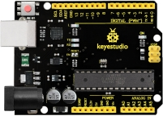                                       |
| USB Cable             AM/BM Blue OD:5.0 L=1m               | 1    |                                        |
| HC-SR04 Ultrasonic Sensor                                  | 1    | 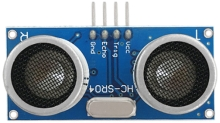                                       |
| KEYESTUDIO TB6612FNG Motor/Servo Drive Shield              | 1    | 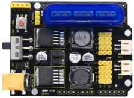                                       |
| KEYESTUDIO Red LED Module                                  | 1    |                                        |
| PS2 Wireless 2.4G Game Controller                          | 1    |                                        |
| Baseplate for Ultrasonic Sensor/Servo                      | 1    | 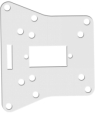                 |
| Car BaseplateT=3.0 KS0520                                  | 1    | 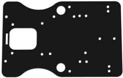                                       |
| Bearing Cap                                                | 1    | 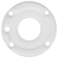               |
| 15 pcs Aluminium Alloy Robot Arm Parts                     | 1    | 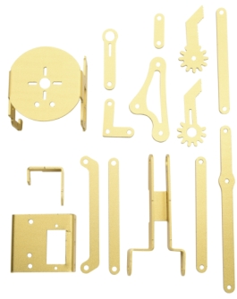                                      |
| 18650 2-Slot Battery Holder with Lead                      | 1    | 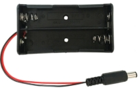                                      |
| KEYESTUDIO Car Wheels                                      | 2    |                |
| 4.5V 200rpm Motor                                          | 2    | 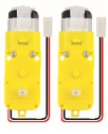                                      |
| AXK Plain Bearing                                          | 1    |                                       |
| Plain Bearing                                              | 2    |                                       |
| Universal Wheel                                            | 1    | 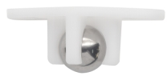                                      |
| Fixed Mount                  23*15*5MM                     | 2    |                |
| M3*30MM Round Head Screws                                  | 4    | 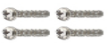                                      |
| MG90S 14G Servo                                            | 4    | 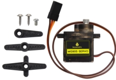                                      |
| M3*10MM Dual-pass Copper Bush                              | 8    | 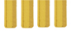                       |
| M3*25MM Dual-pass Copper Bush                              | 2    |                                       |
| M3*30MM Dual-pass Copper Bush                              | 4    |                                       |
| M3*6MM Round Head Nuts                                     | 26   | 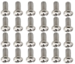 |
| M3*8MM Round Head Screws                                   | 21   | 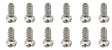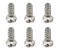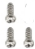 |
| M2.5*10MM Round Head Screws                                | 2    |                                       |
| M3*10MM Flat Head Screws                                   | 3    | 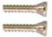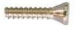               |
| M2*8MM Round Head Screws                                   | 4    | 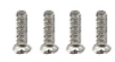                                      |
| M2*12MM Round Head Screws                                  | 6    | 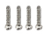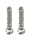               |
| M2 Nickel Plated Nut                                       | 10   |                                       |
| M1.2*4MM Self-tapping Round Head Screws                    | 12   | 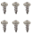               |
| M3 Nickel Plated Nut                                       | 12   |                                       |
| M2.5*20MM Round Head Screws                                | 2    | 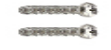                                      |
| M2.5 Nickel Plated Self-locking Nuts                       | 2    |                                       |
| M3 Nickel Plated Self-locking Nuts                         | 14   |                                       |
| White Insulator                                            | 6    |                                       |
| Black Ties 3*100MM                                         | 10   |                                       |
| 20cm 2.54 3pin F-F Dupont Wire Eco-friendly                | 2    | 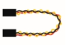                                      |
| M-F 15CM/40P/2.54/10Dupont Wire                            | 0.25 |                                       |
| HX-2.54 4P to Dupont Wire 26AWG 200mm                      | 1    |                                       |
| 3*40MM Red and Black Screwdriver                           | 1    |                                       |
| 2.0*40MM Purple and Black Screwdriver                      | 1    |                                       |
| M2+M3 Wrench                                               | 1    |                                       |
| KEYESTUDIO HM-10 Bluetooth-4.0 V3 Module                   | 1    | 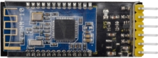                                      |
| Winding Pipe                                               | 1    | 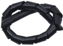                                      |
| 6-Slot AA Battery Holder with 15CM Lead                    | 1    | 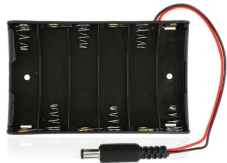                                      |
| M1.4 Nickel Plated Nuts                                    | 6    |                                       |
| M1.4*8MM Round Head Screws                                 | 6    |                                       |

#  **5. Getting Started with Arduino**

  **Installing Arduino IDE**

When we get max control board, we need to download Arduino IDE and driver firstly.You could download Arduino IDE from the official website: <https://www.arduino.cc/>, click the **SOFTWARE** on the browse bar, click “DOWNLOADS” to enter download page, as shown below:

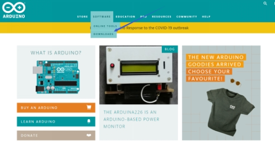

There many versions for Arduino software, you only need to download the version suitable for system. Here, we take WINDOWS system as example to introduce how to download and install Arduino IDE.

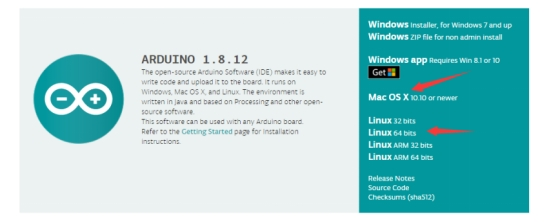

There are two option versions as for your reference, one is an installer which can be directly downloaded in computer; another one is zip file which requires you to unzip and install it. 

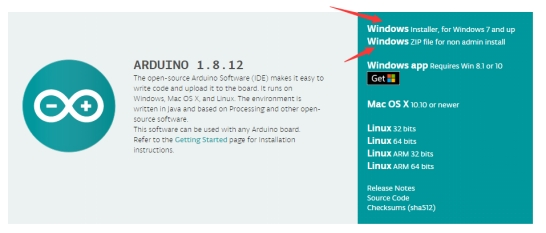


 Just click“JUST DOWNLOAD”.

**（2）KEYESTUDIO V4.0 Development Board**

We need to know keyestudio V4.0 development board, as a core of this smart car.

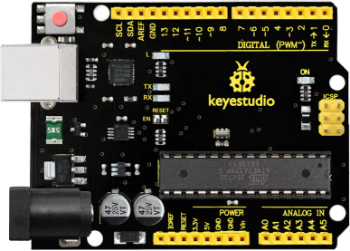

KEYESTUDIO V4.0 development board is an Arduino uno -compatible board, which is based on ATmega328P MCU, and with a cp2102 Chip as a UART-to-USB converter.


It has 14 digital input/output pins (of which 6 can be used as PWM outputs), 6 analog inputs, a 16 MHz quartz crystal, a USB connection, a power jack, 2 ICSP headers and a reset button.


It contains everything needed to support the microcontroller; simply connect it to a computer with a USB cable or power it via an external DC power jack (DC 7-12V) or via female headers Vin/ GND(DC 7-12V) to get started.

| Microcontroller             | ATmega328P-PU                                            |
|-----------------------------|----------------------------------------------------------|
| Operating Voltage           | 5V                                                       |
| Input Voltage (recommended) | DC7-12V                                                  |
| Digital I/O Pins            | 14 (D0-D13) (of which 6 provide PWM output)              |
| PWM Digital I/O Pins        | 6 (D3, D5, D6, D9, D10, D11)                             |
| Analog Input Pins           | 6 (A0-A5)                                                |
| DC Current per I/O Pin      | 20 mA                                                    |
| DC Current for 3.3V Pin     | 50 mA                                                    |
| Flash Memory                | 32 KB (ATmega328P-PU) of which 0.5 KB used by bootloader |
| SRAM                        | 2 KB (ATmega328P-PU)                                     |
| EEPROM                      | 1 KB (ATmega328P-PU)                                     |
| Clock Speed                 | 16 MHz                                                   |
| LED_BUILTIN                 | D13                                                      |

**（3）Installing the Driver of V4.0 Board**

Let’s install the driver of V4.0 board. The USB-TTL chip on PLUS board adopts CP2102 serial chip. The driver program of this chip is included in Arduino 1.8 version and above, which is convenient.

If the version is not above 1.8, you need to download driver of CP2102 in the link:<https://www.silabs.com/products/development-tools/software/usb-to-uart-bridge-vcp-drivers>)

When you attach USB port to computer, the driver of CP2102 can be installed.

If you install unsuccessfully, or intend to install manually, please open the device manager of computer. Right click Computer----- Properties----- Device Manager.

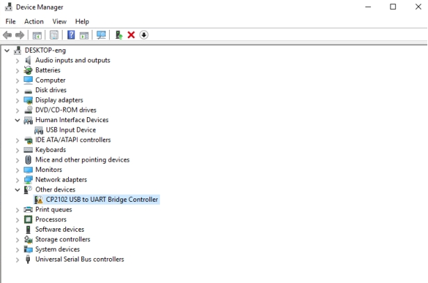

There is a yellow exclamation mark on the page, which implies installing unsuccessfully. Then we double click the hardware and update the driver. 

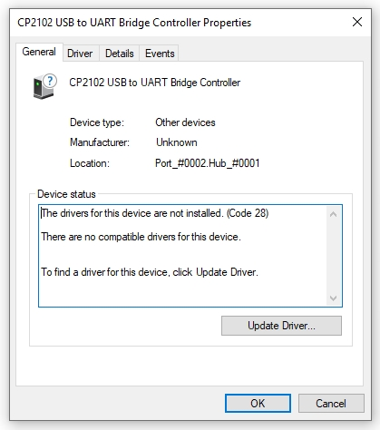

Click“OK”to enter the following page, click“browse my computer for updated driver software”.

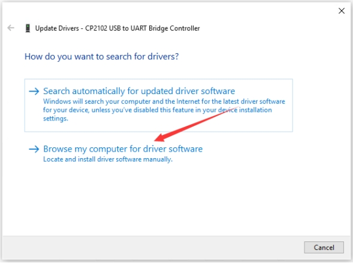

There is a DRIVERS folder in Arduino software installed package（）, open driver folder and you can see the driver of CP210X series chips.

We click“Browse”, then find out the driver folder, or you could enter “driver”to search in rectangular box, then click“next”, the driver will be installed successfully. 

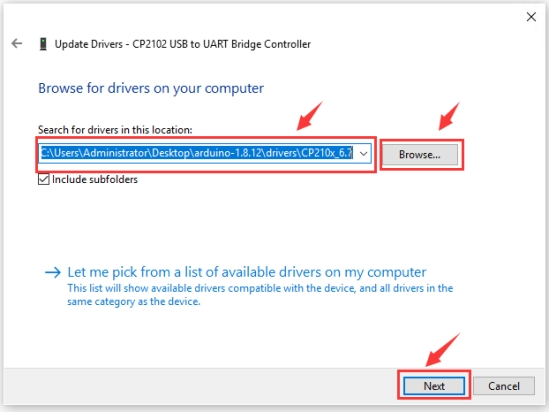

Open device manager, we will find the yellow exclamation mark disappear. The driver of CP2102 is installed successfully.

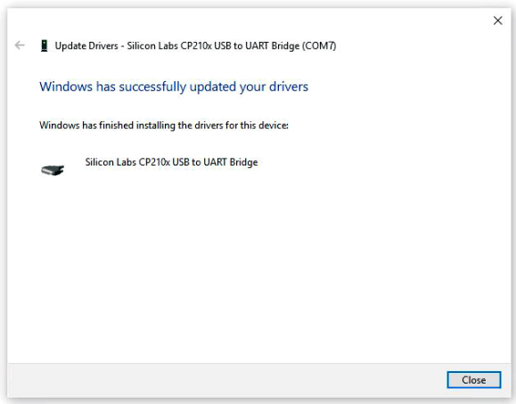

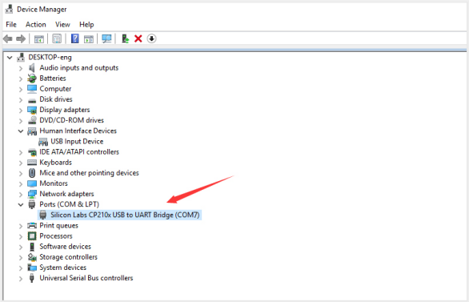

**（4）Arduino IDE Setting**

Clickicon，and open Arduino IDE.

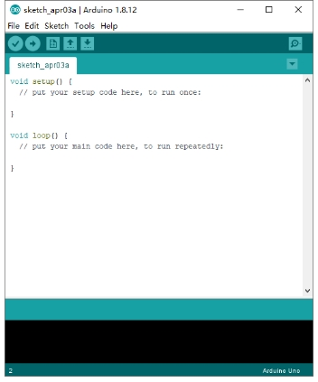

When downloading the sketch to the board, you must select the correct name of Arduino board that matches the board connected to your computer. As shown below;

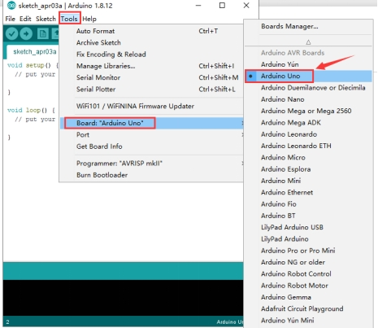

Then select the correct COM port (you can see the corresponding COM port after the driver is successfully installed)

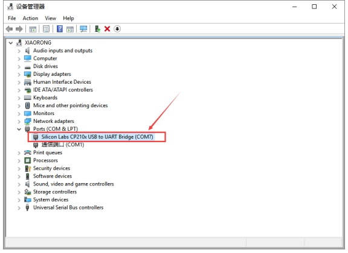

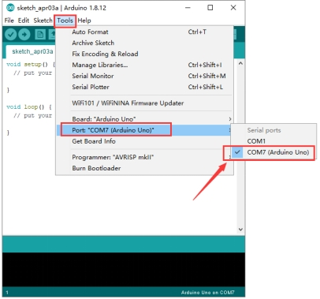

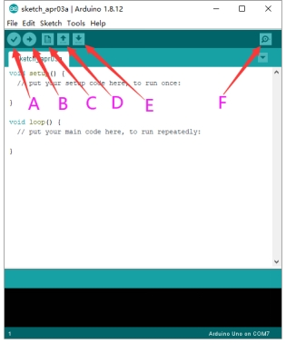

A- Used to verify whether there is any compiling mistakes or not.  

B- Used to upload the sketch to your Arduino board.  

C- Used to create shortcut window of a new sketch.  

D- Used to directly open an example sketch.  

E- Used to save the sketch.  

F- Used to send the serial data received from board to the serial monitor.

**(5) Start Your First Program**

Open the file to select **Example**, and click **BASIC**\>**BLINK**, as shown below:

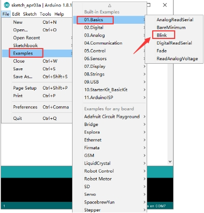 

 

Set the correct **COM port,** and the corresponding board and COM port are shown on the lower right of IDE.

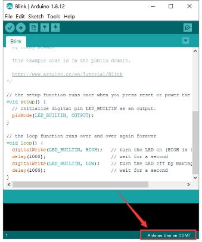 

Clickto start compiling the program, and check errors.

 

Clickto upload the program

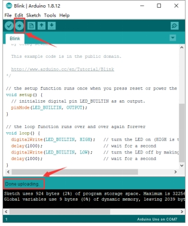 

After the program is uploaded successfully, the onboard LED blinks.

Congratulation, you finish the first program.

#  **6. Add Libraries**

**(1) What are Libraries ?**

[Libraries](https://www.arduino.cc/en/Reference/Libraries) are a collection of code that makes it easy for you to connect to a sensor,display, module, etc.

For example, the built-in LiquidCrystal library helps talk to LCD displays. There are hundreds of additional libraries available on the Internet for download.

The built-in libraries and some of these additional libraries are listed in the reference.

**(2) How to Install a Library ?**

Here we will introduce the most simple way for you to add libraries .  

**Step 1：**After downloading well the Arduino IDE, you can right-click the icon of Arduino IDE.  

Find the option "Open file location" shown as below:


**Step 2:** Enter app to find out libraries folder, this folder is the library file of Arduino.

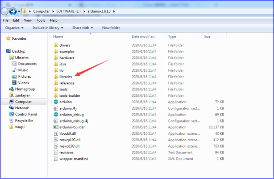

**Step 3：** Next to find out the“libraries”folder of 4DOF robot arm smart car (seen in the link: https://fs.keyestudiocom/KS0520), you just need to replicate and paste it into the libraries folder of Arduino IDE.


 


Copy the above libraries into libraries folder of Arduino.

Then the libraries of robot arm car are installed successfully, as shown below:


#  **7. Projects**

## Project 1 LED Light

 **（1）Description**


For the starter and enthusiast, this is a fundamental program---LED Blink. LED, the abbreviation of light emitting diodes, consist of Ga, As, P, N chemical compound and so on. The LED can flash diverse colors by altering the delay time in the test code. When in control, power on GND and VCC, the LED will be on if S end is high level; nevertheless, it will go off.

  **（2）What You Need**

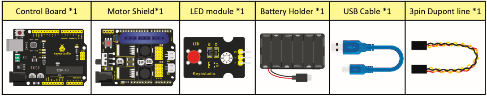

   **（3）Specification**

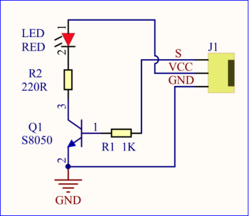

Control interface: digital port  

Working voltage: DC 3.3-5V  

Pin spacing: 2.54mm  

LED display color: red

   **（4）Pins of Motor Driver Shield**


  **（5）Connection Diagram：**


The pin -, + and S are connected to G(GND), V(5V) and S(D6) of shield.

  **（6）Test Code：**

```c++
/*
 keyestudio 4DOF Robot Arm Car
 lesson 1.1  
 Blink
 http://www.keyestudio.com
*/
int ledPin=6;// Define the LED pin at D6
void setup()
{
  pinMode(ledPin, OUTPUT);// initialize ledpin as an output.
}
void loop() // the loop function runs over and over again forever
{
  digitalWrite(ledPin, HIGH); // turn the LED on (HIGH is the voltage level)
  delay(1000); // wait for a second
  digitalWrite(ledPin, LOW); // turn the LED off by making the voltage LOW
  delay(1000); // wait for a second
}

```

 **（7）Test Result：**

Upload the program, LED flickers with the interval of 1s.

 **（8）Code Explanation:**

**pinMode(ledPin，OUTPUT)** - This function denotes that the pin is INPUT or OUTPUT.

**digitalWrite(ledPin，HIGH)** - When pin is OUTPUT, we can set it to HIGH(output 5V) or LOW(output 0V)

 **（9）Extension Practice：**

We succeed to blink LED. Next, let’s observe what LED will change if we modify pins and delay time.

```c++
/*
 KEYESTUDIO 4DOF Mechanical Robot Arm Car
 lesson 1.2
 Blink
 http://www.keyestudiocom
*/
int ledPin=6;// Define the LED pin at D6
void setup()
{
  pinMode(ledPin, OUTPUT);// initialize ledpin as an output.
}
void loop() // the loop function runs over and over again forever
{
  digitalWrite(ledPin, HIGH); // turn the LED on (HIGH is the voltage level)
  delay(100); // wait for 0.1 second
  digitalWrite(ledPin, LOW); // turn the LED off by making the voltage LOW
  delay(100); // wait for 0.1 second
}
```

The LED flickers faster through the test result, therefore, delaying time could affect flash frequency.

## Project 2: Adjust LED Brightness


  **（1）Description：**

In previous lesson, we control LED on and off and make it blink.

In this project, we will control LED brightness through PWM to simulate breathing effect. Similarly, you can change the step length and delay time in the code so as to demonstrate different breathing effect.

PWM is a means of controlling the analog output via digital means. Digital control is used to generate square waves with different duty cycles (a signal that constantly switches between high and low levels) to control the analog output.In general, the input voltage of port are 0V and 5V. What if the 3V is required? Or what if switch among 1V, 3V and 3.5V? We can’t change resistor constantly. For this situation, we need to control by PWM.

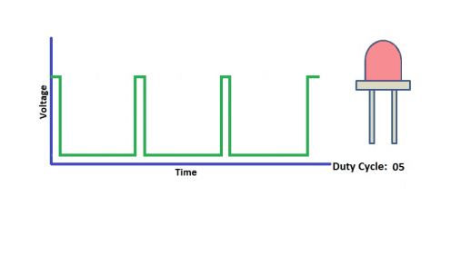

For the Arduino digital port voltage output, there are only LOW and HIGH, which correspond to the voltage output of 0V and 5V. You can define LOW as 0 and HIGH as 1, and let the Arduino output five hundred 0 or 1 signals within 1 second.

If output five hundred 1, that is 5V; if all of which is 1, that is 0V. If output 010101010101 in this way then the output port is 2.5V, which is like showing movie. The movie we watch are not completely continuous. It actually outputs 25 pictures per second. In this case, the human can’t tell it, neither does PWM. If want different voltage, need to control the ratio of 0 and 1. The more 0,1 signals output per unit time, the more accurately control.

 **(2) What You Need**


  **(3) Connection Diagram：**


 **（4）Test Code：**

```c++
#include <Servo.h>
Servo myservo;  // create servo object to control a servo

void setup()
{
  Serial.begin(9600); 
  delay(1000);
}

void loop() 
{
  myservo.attach(A0);  // modify each pin to adjust 
  myservo.write(0);  // angle value  
  delay(1000);
}

```

 **（5）Test Result：**

When the test code is uploaded successfully, LED will smoothly change its brightness from dark to bright and back to dark, continuing to do so, which is similar to a lung breathing in and out.

 **（6）Code Explanation**

When we need to repeat some statements, we could use FOR statement.

FOR statement format is shown below:


FOR cyclic sequence:

Round 1：1 → 2 → 3 → 4

Round 2：2 → 3 → 4

…

Until number 2 is not established, “for”loop is over,

After knowing this order, go back to code:

**for (int value = 0; value \< 255; value=value+1){**

**...}**

**for (int value = 255; value \>0; value=value-1){**

**...}**

The two“for”statements make value increase from 0 to 255, then reduce from 255
to 0, then increase to 255,....infinitely loop

There is a new function in the following ----- analogWrite()

We know that digital port only has two state of 0 and 1. So how to send an analog value to a digital value? Here,this function is needed. Let’s observe the Arduino board and find 6 pins marked“\~”which can output PWM signals.

Function format as follows:

**analogWrite(pin,value)**

analogWrite() is used to write an analog value from 0\~255 for PWM port, so the value is in the range of 0\~255. Attention that you only write the digital pins with PWM function, such as pin 3, 5, 6, 9, 10, 11.

PWM is a technology to obtain analog quantity through digital method. Digital control forms a square wave, and the square wave signal only has two states of turning on and off (that is, high or low levels). By controlling the ratio of the duration of turning on and off, a voltage varying from 0 to 5V can be simulated. The time turning on(academically referred to as high level) is called pulse width, so PWM is also called pulse width modulation.   Through the following five square waves, let’s learn more about PWM.


In the above figure, the green line represents a period, and value of analogWrite() corresponds to a percentage which is called Duty Cycle as well. Duty cycle implies that high-level duration is divided by low-level duration in a cycle. From top to bottom, the duty cycle of first square wave is 0% and its corresponding value is 0. The LED brightness is lowest, that is, turn off. The more time high level lasts, the brighter the LED. Therefore, the last duty cycle is 100%, which correspond to 255, LED is brightest. 25% means darker.

PWM mostly is used for adjusting the LED brightness or rotation speed of motor.

It plays vital role in controlling smart robot car. I believe that you can’t wait to enter next project.

 **（7）Extension Practice：**

Let’s modify the value of delay time and remain the pin unchanged, then observe how LED changes.

```c++
/*
 KEYESTUDIO 4DOF Mechanical Robot Arm Car
 lesson 2.2
 pwm
 http://www.keyestudiocom
*/
int ledPin = 6; // Define the LED pin at D6
void setup(){
  pinMode (ledPin, OUTPUT); // initialize ledpin as an output.
}
void loop(){
  for (int value = 0; value <255; value = value + 1){
    analogWrite (ledPin, value); // LED lights gradually light up
    delay (30); // delay 30MS
  }
  for(int value=255; value>0;value=value-1){
    analogWrite (ledPin, value); // LED gradually goes out
    delay (30); // delay 30MS
  }
}//**********************************************************
```

LED flickers more slowly.

## Project 3 Servo Control


 **（1）Description**

Servo motor is a position control rotary actuator. It mainly consists of housing, circuit board, core-less motor, gear and position sensor. Its working principle is that the servo receives the signal sent by MCU or receiver and produces a reference signal with a period of 20ms and width of 1.5ms, then compares the acquired DC bias voltage to the voltage of the potentiometer and obtain the voltage difference output.

When the motor speed is constant, the potentiometer is driven to rotate through the cascade reduction gear, which leads that the voltage difference is 0, and the motor stops rotating. Generally, the angle range of servo rotation is 0° --180 °

The rotation angle of servo motor is controlled by regulating the duty cycle of PWM (Pulse-Width Modulation) signal. The standard cycle of PWM signal is 20ms (50Hz). Theoretically, the width is distributed between 1ms-2ms, but in fact , it's between 0.5ms-2.5ms. The width corresponds the rotation angle from 0° to 180°. But note that for different brand motor, the same signal may have different rotation angle.


In general, servo has three lines in brown, red and orange. Brown wire is grounded, red one is positive pole line and orange one is signal line.


The corresponding servo angles are shown below:


 **（2）Specification**

Working voltage: DC 4.8V \~ 6V  

Operating angle range: about 180 ° (at 500 → 2500 μsec)  

Pulse width range: 500 → 2500 μsec  

No-load speed: 0.12 ± 0.01 sec / 60 (DC 4.8V) 0.1 ± 0.01 sec / 60 (DC 6V)  

No-load current: 200 ± 20mA (DC 4.8V) 220 ± 20mA (DC 6V)  

Stopping torque: 1.3 ± 0.01kg · cm (DC 4.8V) 1.5 ± 0.1kg · cm (DC 6V)  

Stop current: ≦ 850mA (DC 4.8V) ≦ 1000mA (DC 6V)

Standby current: 3 ± 1mA (DC 4.8V) 4 ± 1mA (DC 6V)

 **（3）What You Need**


  **（4）Connection Diagram：**


Wiring note: the brown wire of servo is linked with Gnd(G), the red one is connected to 5v(V) and orange one is attached to digital 9.

The servo has to be connected to external power due to its high demand for driving servo current. Generally, the current of development board is not enough. If without connected power, the development board could be burnt.

  **（5）Test Code：**

```c++
/*
keyestudio 4DOF Robot Arm Car
lesson 3.1
Servo
http://www.keyestudio.com
*/ 
#define servoPin 9  //servo Pin
int pos; //angle variable of servo
int pulsewidth; //pulsewidth variable of servo
void setup() {
  pinMode(servoPin, OUTPUT);  //set pins of servo to output
  procedure(0); //set angle of servo to 0°
}
void loop() {
  for (pos = 0; pos <= 180; pos += 1) { // goes from 0 degrees to 180 degrees
    // in steps of 1 degree
    procedure(pos);              // tell servo to go to position in variable 'pos'
    delay(15);                   //control the rotation speed of servo
  }
  for (pos = 180; pos >= 0; pos -= 1) { // goes from 180 degrees to 0 degrees
    procedure(pos);              // tell servo to go to position in variable 'pos'
    delay(15);                    
  }}
//Function to control servo
void procedure(int myangle) {
  pulsewidth = myangle * 11 + 500;  //Calculate pulsewidth value
  digitalWrite(servoPin,HIGH);
  delayMicroseconds(pulsewidth);   //the duration of high levle is pulsewidth
  digitalWrite(servoPin,LOW);
  delay((20 - pulsewidth / 1000));  //the period is 20ms, low level lasts the rest of time
}
//***************************************************************************
```

After the code is uploaded successfully, servo swings forth and back in the range of 0° to 180°

There is another guide for restraining servo---- servo library file, the following link of official website is as for your reference. 
<https://www.arduino.cc/en/Reference/Servo>

 **(6)Test Code2:**

```c++
/*
 KEYESTUDIO 4DOF Mechanical Robot Arm Car
 lesson 3.2
 servo
 http://www.keyestudiocom
*/
#include <Servo.h>
Servo myservo;  // create servo object to control a servo
// twelve servo objects can be created on most boards
int pos = 0;    // variable to store the servo position
void setup() {
  myservo.attach(9);  // attaches the servo on pin 9 to the servo object
}
void loop() {
  for (pos = 0; pos <= 180; pos += 1) { // goes from 0 degrees to 180 degrees
    // in steps of 1 degree
    myservo.write(pos);              // tell servo to go to position in variable 'pos'
    delay(15);                       // waits 15ms for the servo to reach the position
  }
  for (pos = 180; pos >= 0; pos -= 1) { // goes from 180 degrees to 0 degrees
    myservo.write(pos);              // tell servo to go to position in variable 'pos'
    delay(15);                       // waits 15ms for the servo to reach the position
  }
}
//************************************************************************
```

 **（7）Test Result：**

Upload code successfully and power on, servo swings in the range of 0° to 180°. The result is same. We usually control it by library file.

 **（8）Code Explanation:**

Arduino comes with **\#include \<Servo.h\>** (servo function and statement）

The following are some common statements of the servo function:  

1\. **attach（interface）**——Set servo interface, port 9 and 10 are available

2\. **write（angle）**——The statement to set rotation angle of servo, the angle range is from 0° to 180°  

3\. **read（）**——used to read angle of servo, read the command value of“write()”

4\. **attached（）**——Judge if the parameter of servo is sent to its interface  

Note: The above written format is“servo variable name, specific statement（）”, for instance: myservo.attach(9)

## Project 4 Ultrasonic Sensor


 **（1） Description：**


The HC-SR04 ultrasonic sensor uses sonar to determine distance to an object like bats do. It offers excellent non-contact range detection with high accuracy and stable readings in an easy-to-use package. It comes complete with ultrasonic transmitter and receiver modules.

The HC-SR04 or the ultrasonic sensor is being used in a wide range of electronics projects for creating obstacle detection and distance measuring application as well as various other applications. Here we have brought the simple method to measure the distance with arduino and ultrasonic sensor and how to use ultrasonic sensor with arduino.


 **（2）Specification：**

Power Supply :+5V DC

Quiescent Current : \<2mA

Working Current: 15mA

Effectual Angle: \<15°

Ranging Distance : 2cm – 400 cm

Resolution : 0.3 cm

Measuring Angle: 30 degree

Trigger Input Pulse width: 10uS

 **(3) What You Need**


 **(4) The principle of ultrasonic sensor**

As the above picture shown, it is like two eyes. One is transmitting end, the other is receiving end.

The ultrasonic module will emit the ultrasonic waves after trigger signal. When the ultrasonic waves encounter the object and are reflected back, the module outputs an echo signal, so it can determine the distance of object from the time difference between trigger signal and echo signal.   The t is the time that emitting signal meets obstacle and returns. and the propagation speed of sound in the air is about 343m/s, therefore, distance = speed \* time, because the ultrasonic wave emits and comes back, which is 2 times of distance, so it needs to be divided by 2, the distance
measured by ultrasonic wave = (speed \* time)/2

1.  Use method and timing chart of ultrasonic module:  
2.  Setting the delay time of Trig pin of SR04 to 10μs at least, which can trigger it to detect distance.  
3.  After triggering, the module will automatically send eight 40KHz ultrasonic pulses and detect whether there is a signal return. This step will be completed automatically by the module.  
4.   If the signal returns, the Echo pin will output a high level, and the duration of the high level is the time from the transmission of the
    ultrasonic wave to the return.


Circuit diagram of ultrasonic sensor:


 （5） Connection Diagram：


Wiring Guide:

Ultrasonic sensor keyestudio V5 expansion board

VCC → 5v(V)

Trig → A4(S)

Echo → A3(S)

Gnd → Gnd(G)

 **（6） Test Code：**

```c++
/*
 KEYESTUDIO 4wd Mechanical Robor Arm Car
 lesson 4.1
 Ultrasonic sensor
 http://www.keyestudiocom
*/ 
int trigPin = A4;    // Trigger
int echoPin = A3;    // Echo
long duration, cm, inches;
 void setup() {
  //Serial Port begin
  Serial.begin (9600);
  //Define inputs and outputs
  pinMode(trigPin, OUTPUT);
  pinMode(echoPin, INPUT);
}
void loop() {
  // The sensor is triggered by a HIGH pulse of 10 or more microseconds.
  // Give a short LOW pulse beforehand to ensure a clean HIGH pulse:
  digitalWrite(trigPin, LOW);
  delayMicroseconds(2);
  digitalWrite(trigPin, HIGH);
  delayMicroseconds(10);
  digitalWrite(trigPin, LOW);
   // Read the signal from the sensor: a HIGH pulse whose
  // duration is the time (in microseconds) from the sending
  // of the ping to the reception of its echo off of an object.
  duration = pulseIn(echoPin, HIGH);
   // Convert the time into a distance
  cm = (duration/2) / 29.1;     // Divide by 29.1 or multiply by 0.0343
  inches = (duration/2) / 74;   // Divide by 74 or multiply by 0.0135
    Serial.print(inches);
  Serial.print("in, ");
  Serial.print(cm);
  Serial.print("cm");
  Serial.println();
  delay(50);
}
//**************************************************************************
```

 **（7）Test Result：**

Upload test code on the development board, open serial monitor and set baud rate to 9600. The detected distance will be displayed(unit is cm and inch). Hinder the ultrasonic sensor by hand, then the displayed distance value gets smaller.


 **（8）Code Explanation:**

**int trigPin-** this pin is defined to transmit ultrasonic waves, generally output.

**int echoPin -** this is defined as the pin of reception, generally input

**cm = (duration/2) / 29.1-unit is cm**

**inches = (duration/2) / 74-unit is inch**

We can calculate the distance by using the following formula:  distance = (traveltime/2) x speed of sound

The speed of sound is: 343m/s = 0.0343 cm/uS = 1/29.1 cm/uS

Or in inches: 13503.9in/s = 0.0135in/uS = 1/74in/uS

We need to divide the traveltime by 2 because we have to take into account that the wave was sent, hit the object, and then returned back to the sensor.

 **（9）Extension Practice：**

We have just measured the distance displayed by the ultrasonic. How about controlling the LED with the measured distance? Let's try it, connect an LED module to the D6 pin.


```c++
/*
 KEYESTUDIO 4wdMechanical Robor Arm Car
 lesson 4.2
 Ultrasonic LED
 http://www.keyestudiocom
*/ 
int trigPin = A4;    // Trigger
int echoPin = A3;    // Echo
long duration, cm, inches;
void setup() {
  Serial.begin (9600);  //Serial Port begin
  pinMode(trigPin, OUTPUT);  //Define inputs and outputs
  pinMode(echoPin, INPUT);
  pinMode(6, OUTPUT);
}
 void loop() 
{
  // The sensor is triggered by a HIGH pulse of 10 or more microseconds.
  // Give a short LOW pulse beforehand to ensure a clean HIGH pulse:
  digitalWrite(trigPin, LOW);
  delayMicroseconds(2);
  digitalWrite(trigPin, HIGH);
  delayMicroseconds(10);
  digitalWrite(trigPin, LOW);
  // Read the signal from the sensor: a HIGH pulse whose duration is the time (in microseconds) from the sending of the ping to the reception of its echo off of an object.
  duration = pulseIn(echoPin, HIGH);
  // Convert the time into a distance
  cm = (duration/2) / 29.1;     // Divide by 29.1 or multiply by 0.0343
  inches = (duration/2) / 74;   // Divide by 74 or multiply by 0.0135
  Serial.print(inches);
  Serial.print("in, ");
  Serial.print(cm);
  Serial.print("cm");
  Serial.println();
  delay(50);
if (cm>=2 && cm<=10)digitalWrite(6, HIGH);
else digitalWrite(6, LOW);
}
//****************************************************************
```

Upload test code to development board and put you hand away from ultrasonic sensor for 2cm-10cm, then LED will be on.

## Project 5 Bluetooth Remote Control

 **（1）Description：**

Bluetooth, a simple wireless communication module most popular since the last few decades and easy to use are being used in most of the battery-powered devices.


Over the years, there have been many upgrades of Bluetooth standard to keep fulfil the demand of customers and technology according to the need of time and situation.

Over the few years, there are many things changed including data transmission rate, power consumption with wearable and IoT Devices and Security System.

Here we are going to learn about HM-10 BLE 4.0 with Arduino Board. The HM-10 is a readily available Bluetooth 4.0 module. This module is used for establishing wireless data communication. The module is designed by using the Texas Instruments CC2540 or CC2541 Bluetooth low energy (BLE) System on Chip (SoC).

 **（2）Specification**


- Bluetooth protocol: Bluetooth

- Specification V4.0 BLE

- No byte limit in serial port Transceiving

- In open environment, realize 100m ultra-distance communication with iphone4s

- Working frequency: 2.4GHz ISM band

- Modulation method: GFSK(Gaussian Frequency Shift Keying)

- Transmission power: -23dbm, -6dbm, 0dbm, 6dbm, can be modified by AT command.

- Sensitivity: ≤-84dBm at 0.1% BER

- Transmission rate: Asynchronous: 6K bytes ; Synchronous: 6k Bytes

- Security feature: Authentication and encryption

- Supporting service: Central & Peripheral UUID FFE0, FFE1

- Power consumption: Auto sleep mode, stand by current 400uA\~800uA, 8.5mA during transmission.

- Power supply: 5V DC

- Working temperature: –5 to +65 Centigrade


 **（3）What You Need:**


  **(4)Connection Diagram：**


Wiring Guide

| Bluetooth Module | Expansion Board |
| :--------------: | :-------------: |
|VCC| VCC|
|GND |GND|
|TXD |RXD|
|RXD |TXD|

Note: don’t insert Bluetooth module reversely.

**(4) Test Code：**

```c++
/*
 KEYESTUDIO 4DOF Mechanical Robot Arm Car
 lesson 5
 Bluetooth 
 http://www.keyestudiocom
*/ 
char blue_val;  //define a variable to receiver Bluetooth signals
void setup() {
  Serial.begin(9600);	//set baud rate to 9600
}
void loop() {
  if(Serial.available() > 0)//receive Bluetooth signals
  {
    blue_val = Serial.read();  //Reception
    Serial.println(blue_val);  //Serial prints Bluetooth signals
  }
}
```

**(5)Download APP：**

The code is the signals received by serial port, we still need to send signals, hence the need of app which sends signals to Bluetooth module to print them on serial port.

**Note: Allow APP to access“location”in settings of your cellphone when connecting to Bluetooth module, otherwise, Bluetooth may not be connected.**

**1. iOS system**

Search “keyes arm” in App store


After it is downloaded, enter the main page.


Turn on Bluetooth in your cellphone.

Click **Connect** to search Bluetooth, tap“connect” if HMSoft appears and click  icon, and enter the main page.


2\. Android System

Search keyes arm car in Google play store and install


The interface is shown as below:


Click on APP icon to search the Bluetooth.


Click“connect”if HMSoFT appear, then Bluetooth LED will be turned on.

**After app is downloaded, allow APP to access“location”, and you could enable“location”in settings of your cellphone.**

Open Bluetooth and search HMSoft, then tap“connect”to operate App.

The function of each key on App is shown below:

| Key                                                          | Control character                  | Function                                                     |
| ------------------------------------------------------------ | ---------------------------------- | ------------------------------------------------------------ |
|                                      |                                    | Match with connection HM-10 Bluetooth module                 |
|                                      |                                    | Disconnect Bluetooth                                         |
|  | Press: F<br />Release: S           | Press the button to go front; release to stop                |
|                                      | Press: L<br />Release: S           | Press button to turn left; release to stop                   |
|                                      | Press: R<br />Release: S           | Press button to turn right; release to stop                  |
|                                      | Press: B<br />Release: S           | Press button to go back; release to stop                     |
|                                      | Press: a<br />Release: S           | Press button to speed up；release to stop                    |
|                                      | Press: d<br />Release: S           | Press button to speed down；release to stop                  |
|                                      | Press: V<br />Release: s           | Press button to open claw，release to stop                   |
|                                      | Press: P<br />Release: s           | Press button to close claw，release to stop                  |
|                                      | Press: Q<br />Release: s           | Press F1 to lift up smaller arm，release to stop             |
|                                      | Press: E<br />Release: s           | Small arm lowers，release to stop                            |
|                                      | Press: f<br />Release: s           | Large arm swings forward，release to stop                    |
|                                      | Press:b<br />Release: s            | Large arm swings back，Release to stop                       |
|                                      | Press: l<br />Release: s           | Press L to turn left，Release to stop                        |
|                                      | Press: r<br />Release: s           | Press L to turn right，Release to stop                       |
|                                      | Press: t<br />Release: s           | Press key to read and save angle value of servo              |
|                                      | Press: i<br />Release: s           | Save the angle value of servos                               |
|                                      |                                    | Click to start the mobile gravity sensing; click again to exit |
|                                      | Click to send “Y” , then click “S” | Press to enable obstacle avoidance,                          |
|                                      | Click to send “U” , then click “S” | Start Ultrasonic follow function; click Stop to exit         |

 (6) Code Explanation:

Serial.available()：the number of left characters when back to buffer, this function is usually used to judge if there is data in buffer. Whenever Serial.available() is more than 0, serial receives the data in serial monitor.

Serial.read(): read a Byte in buffer of serial, we could read the data sent with Serial.read(), for instance, some device send data to Arduino through serial monitor.

## Project 6 Motor Driving and Speed Control

 **(1) Description：**

Based on the TB6612FNG driver IC design, the motor driver on the expansion board adopts a special logic control method. Only 4 pins could achieve dual motor control. Compared with pure chips, it lacks two IO pins and can be applied in more fields, saving valuable IO resources for Arduino and other controllers.  

TB6612FNG is a dual-channel full-bridge driver chip. The maximum continuous drive current of a single channel can reach 1.2A, and the peak value is 2A/3.2A (continuous pulse/single pulse), which can drive some micro DC motors.


 **(2) Specification：**

-   Logic part input voltage VCC: 3.3\~5V

-   Drive part input voltage VM: 2.5\~12V

-   Number of drive motors: 2 channels

-   Maximum continuous drive current of single channel: 1.2A

-   Starting peak value: 2A/3.2A (continuous pulse/single pulse)

 **(3) What You Need**


 **(4) Connection Diagram：**


  **(5) Test Code：**

```c++
/*
 keyestudio 4DOF Mechanical Robot Arm Car
 lesson 6
 motor driver shield
 http://www.keyestudio.com
*/ 
int AIN2=2;  //define direction control pin of motor A as D2
int PWMA=3;  //define speed control pin of motor A as D3
int BIN2=4;   //define direction control pin of motor B as D4
int PWMB=5; //define speed control pin of motor B as D5

void setup(){
  pinMode(AIN2,OUTPUT);  //set ports of motor to output
  pinMode(PWMA,OUTPUT);
  pinMode(BIN2,OUTPUT);
  pinMode(PWMB,OUTPUT);
}
void loop(){  //go forward for 1s, back for 1s, turn left for 1s, right for 1s and stop for 1s
    //Go front
  digitalWrite(AIN2,LOW); //If AIN2 is low, AIN1 is high，motor MA turns clockwise
  analogWrite(PWMA,120); //rotation speed of motor MA is 120
  digitalWrite(BIN2,HIGH);  //If BIN2 is high, BIN1 is low，motor MB turns clockwise
  analogWrite(PWMB,120);//rotation speed of motor MB is 120
  delay(1000);
  
    //Go back
  digitalWrite(BIN2,LOW); //if BIN2 is low, BIN1 is high，motor MB turns anticlockwise
  analogWrite(PWMB,80); //rotation speed of motor MB is 80
  digitalWrite(AIN2,HIGH);  //AIN2 is high,AIN1 is low，motor MA turns anticlockwise
  analogWrite(PWMA,80); //rotation speed of motor MA is 80
  delay(1000);
  
    //Turn Left
  digitalWrite(AIN2,HIGH);  //If AIN2 is high, AIN1 is low，motor MA turns anticlockwise
  analogWrite(PWMA,120); //rotation speed of motor MA is 120
  digitalWrite(BIN2,HIGH);  //BIN2 is high,BIN1 is low，motor MB turns clockwise
  analogWrite(PWMB,120);//rotation speed of motor MB is 120
  delay(1000);
  
  //Turn right
  digitalWrite(AIN2,LOW); //If AIN2 is low, AIN1 is high，motor MA turns clockwise
  analogWrite(PWMA,80); //rotation speed of motor MA is 80
  digitalWrite(BIN2,LOW); //If BIN2 is low, and BIN1 is high，motor MB turns anticlockwise
  analogWrite(PWMB,80); //rotation speed of motor MB is 80
  delay(1000);

  //Stop
  analogWrite(PWMA,0);  //rotation speed of motor MA is 0
  analogWrite(PWMB,0);  //rotation speed of motor MB is 0
  delay(1000);
}
```

 **(6) Test Result：**

Hook up by connection diagram, upload code and power on. The motor A and B rotate clockwise for 1s and anti-clockwise for 1s, then they stop.

## Project 7 PS2 Joypad Controller


 (1) Description：

The PS2 joypad controller is compatible with PlayStation2 game consoles. Sony's psx series game consoles are very popular all over the world, hence someone cracked the ps2 communication protocol so that the devices can be controlled remotely by handle, such as remote control smart car.

The PS2 joypad is composed of a handle and a receiver. The handle is used to send button information; the receiver is connected to the microcontroller (also called the host) to receive the information sent by the handle and pass it to the microcontroller. The microcontroller can also sends commands to the controller and configures the sending mode of the joypad by receiver.

 **(2) Pins of Receiver**


1\. Data: host line, used to send data to the slave station (MOSI)  

2\. Command: Slave line, used to send data to the master station (MISO)  

3\. Vibration: the power supply of the vibration motor; 7.2V to 9V  

4\. Ground: circuit ground  

5\. VCC: power supply 3.3V  

6\. Attention: CS or chip select pin is used to call the slave and prepare to connect  

7\. Clock: equivalent to SCK pin of clock  

8\. No Connection: Useless  

9\. Knowledge: the response signal from the controller to the PS2 receiver

Insert PS2 receiver on development board

**(3) Test Code：**

```c++
/*
 KEYESTUDIO 4DOF Mechanical Robot Arm Car
 lesson 7
 PS2 
 http://www.keyestudiocom
*/ 
#include <PS2X_lib.h>
#define PS2_DAT   12
#define PS2_CMD   11
#define PS2_SEL   10
#define PS2_CLK   13
#define pressures   true
//#define pressures   false
#define rumble    true
//#define rumble    false
PS2X ps2x;
int error=0;
byte type=0;
byte vibrate=0;
void setup(){
  Serial.begin(57600);
  delay(300);
  error=ps2x.config_gamepad(PS2_CLK, PS2_CMD, PS2_SEL, PS2_DAT, pressures, rumble);
  if(error==0){
    Serial.println("Found Controller, configured successful ");
    Serial.println("pressures = ");
    if(pressures) Serial.println("ture");
    else Serial.println("false");
    
    Serial.println("rumble = ");    
    if(rumble) Serial.println("ture");
    else Serial.println("false");
    Serial.println("Try out all the buttons, X will vibrate the controller, faster as you press harder;");
    Serial.println("holding L1 or R1 will print out the analog stick values.");
    Serial.println("Note: Go to www.billporter.info for updates and to report bugs.");
  }
  else if(error==1){
    Serial.println("No controller found, check wiring, see readme.txt to enable debug. visit www.billporter.info for troubleshooting tips");    
  }
  else if(error==2){
    Serial.println("Controller found but not accepting commands. see readme.txt to enable debug. Visit www.billporter.info for troubleshooting tips");  
  }
  else if(error==3){
    Serial.println("Controller refusing to enter Pressures mode, may not support it. ");
  }
  
  type=ps2x.readType();
  switch(type){
    case 0:   Serial.print("Unknown Controller type found ");   break;
    case 1:   Serial.print("DualShock Controller found ");    break;
    case 2:   Serial.print("GuitarHero Controller found ");   break;
    case 3:   Serial.print("Wireless Sony DualShock Controller found ");    break;
  }  
}

void loop(){
  if(error==1) return;
  if(error==2){
      ps2x.read_gamepad();
      if(ps2x.ButtonPressed(GREEN_FRET))  Serial.println("Green Fret Pressed");
      if(ps2x.ButtonPressed(RED_FRET))    Serial.println("Red Fret Pressed");
      if(ps2x.ButtonPressed(YELLOW_FRET)) Serial.println("Yellow Fret Pressed");
      if(ps2x.ButtonPressed(BLUE_FRET))   Serial.println("Blue Fret Pressed");
      if(ps2x.ButtonPressed(ORANGE_FRET)) Serial.println("Orange Fret Pressed"); 

      if(ps2x.ButtonPressed(STAR_POWER))  Serial.println("Star Power Command");

      if(ps2x.Button(UP_STRUM))    Serial.println("Up Strum");
      if(ps2x.Button(DOWN_STRUM))  Serial.println("DOWN Strum");

      if(ps2x.Button(PSB_START))    Serial.println("Start is being held");
      if(ps2x.Button(PSB_SELECT))   Serial.println("Select is being held");

      if(ps2x.Button(ORANGE_FRET)){
          Serial.print("Wammy Bar Position:");
          Serial.println(ps2x.Analog(WHAMMY_BAR), DEC);
      }
  }
  else{
    ps2x.read_gamepad(false, vibrate);
    if(ps2x.Button(PSB_START))      Serial.println("Start is being held");
    if(ps2x.Button(PSB_SELECT))     Serial.println("Select is being held");
    
    if(ps2x.Button(PSB_PAD_UP)){
      Serial.print("Up held this hard: ");
      Serial.println(ps2x.Analog(PSAB_PAD_UP), DEC);  
    } 
    if(ps2x.Button(PSB_PAD_RIGHT)){
      Serial.print("Right held this hard: ");
      Serial.println(ps2x.Analog(PSAB_PAD_RIGHT), DEC);
    }
    if(ps2x.Button(PSB_PAD_LEFT)){
      Serial.print("LEFT held this hard: ");
      Serial.println(ps2x.Analog(PSAB_PAD_LEFT), DEC);
    }
    if(ps2x.Button(PSB_PAD_DOWN)){
      Serial.print("DOWN held this hard: ");
      Serial.println(ps2x.Analog(PSAB_PAD_DOWN), DEC);
    }

    vibrate = ps2x.Analog(PSAB_CROSS);
    if (ps2x.NewButtonState()){
      if(ps2x.Button(PSB_L3))       Serial.println("L3 pressed");
      if(ps2x.Button(PSB_R3))       Serial.println("R3 pressed");
      if(ps2x.Button(PSB_L2))       Serial.println("L2 pressed");
      if(ps2x.Button(PSB_R2))       Serial.println("R2 pressed");

      if(ps2x.Button(PSB_GREEN)) Serial.println("GREEN pressed");
      if(ps2x.Button(PSB_RED)) Serial.println("RED pressed");
      if(ps2x.Button(PSB_BLUE)) Serial.println("BLUE pressed");
      if(ps2x.Button(PSB_PINK)) Serial.println("PINK pressed");
    }

    if(ps2x.Button(PSB_L1) || ps2x.Button(PSB_R1)){
      Serial.print("Stick Values:");
      Serial.print(ps2x.Analog(PSS_LY), DEC); //Left stick, Y axis. Other options: LX, RY, RX  
      Serial.print(",");
      Serial.print(ps2x.Analog(PSS_LX), DEC); 
      Serial.print(",");
      Serial.print(ps2x.Analog(PSS_RY), DEC);  
      Serial.print(",");
      Serial.println(ps2x.Analog(PSS_RX), DEC);
    }
  }
  delay(50);
}
```

**Read each key value on PS2 joypad and record in the following form.**


| Key       | Logic                                                                                     |
|-----------|-------------------------------------------------------------------------------------------|
| PAD UP    | ps2x.Button(PSB_PAD_UP) will be TRUE as long as button is pressed                         |
| PAD LEFT  | ps2x.Button(PSB_PAD_LEFT) will be TRUE as long as button is pressed                       |
| PAD RIGHT | ps2x.Button(PSB_PAD_RIGHT) will be TRUE as long as button is pressed                      |
| PAD DOWN  | ps2x.Button(PSB_PAD_DOWN) will be TRUE as long as button is pressed                       |
| L1        | ps2x.Button(PSB_L1) will be TRUE if the button changes state (on to off, or off to on)    |
| L2        | ps2x.Button(PSB_L2) will be TRUE if the button changes state (on to off, or off to on)    |
| R1        | ps2x.Button(PSB_R1) will be TRUE if the button changes state (on to off, or off to on)    |
| R2        | ps2x.Button(PSB_R2) will be TRUE if the button changes state (on to off, or off to on)    |
| L3        | ps2x.Button(PSB_L3) will be TRUE if the button changes state (on to off, or off to on)    |
| R3        | ps2x.Button(PSB_R3) will be TRUE if the button changes state (on to off, or off to on)    |
| GREEN     | ps2x.Button(PSB_GREEN) will be TRUE if the button changes state (on to off, or off to on) |
| PINK      | ps2x.ButtonReleased(PSB_PINK) will be TRUE if button was JUST released                    |
| RED       | ps2x.ButtonPressed(PSB_RED) will be TRUE if button was JUST pressed                       |
| BLUE      | ps2x.NewButtonState(PSB_BLUE) will be TRUE if button was JUST pressed OR released         |
| SELECT    | ps2x.Button(PSB_SELECT) will be TRUE as long as button is pressed                         |
| START     | ps2x.Button(PSB_START) will be TRUE as long as button is pressed                          |
| LX        | Left stick, X axis. value:0\~255                                                          |
| LY        | Left stick, Y axis. value:0\~255                                                          |
| RX        | Right stick, X axis. value:0\~255                                                         |
| RY        | Right stick, Y axis. value:0\~255                                                         |

Note：print stick values if L1 or L2 is TRUE，you have to press L1 or L2 to print the value of joystick.

**(4) Test Result：**

Upload code, plug in PS2 receiver and joypad, open serial monitor and set baud rate to 9600. The corresponding value will be shown when pressing the keys on joypad.

## Project 8 Smart Car

Note: Peel the plastic film off the board first when installing the smart car.

Installation Guide


 Mount Car Wheels                                                                                                                                    


 Assemble Ultrasonic Sensor          


 Screw Copper Bushes     


 Install the V 4.0 Development Board        


 Mount Battery Holder and Motor Shield             


You could choose the battery holder you want.(2-slot or 6-slot) 


 Assemble Baseboard of Servo


 Wire up Motor                                                                                     


 Wire up Ultrasonic Sensor                                                                                                                           

                                                                                                    

 Connect Battery Holder                                                                             


 Turtle Smart Car                                                                                                                                    


## Project 9 Ultrasonic Follow Robot

 **(1) Description：**

In this project, we will make robot car demonstrate ultrasonic following effect.

Ultrasonic sensor detects the distance away from obstacle and sends data to single-chip controller, hence the two motors are driven by data.

**Flow Chart**


 **(2)Connection Diagram：**


 **(3) Test Code：**

```c++
/*
 keyestudio 4DOF Mechanical Robot Car
lesson 9.1
Ultrasonic Follow Robot 
http://www.keyestudio.com
*/ 
int AIN2=2;  //define driving pins of servo
int PWMA=3; 
int BIN2=4; //When AIN2 is high and AIN1 is low，
int PWMB=5;
int echoPin=A3;  // ultrasonic module   ECHO to A3
int trigPin=A4;  // ultrasonic module   TRIG to A4

int Ultrasonic_Ranging(){  //Ultrasonic_Ranging Function
  digitalWrite(trigPin, LOW);  
  delayMicroseconds(2); 
  digitalWrite(trigPin, HIGH); 
  delayMicroseconds(10);  //send least 10us high level to trigger ultrasonic waves to trig pin
  digitalWrite(trigPin, LOW);    
  int distance = pulseIn(echoPin, HIGH);  // reading the duration of high level
  distance= distance/58;   // Transform pulse time to distance     
  delay(50); 
  return distance;    //return distance to this function
}

void advance(){    //car goes front
  digitalWrite(AIN2,LOW); //when AIN2 is low and AIN1 is high, motor MA turns clockwise
  analogWrite(PWMA,100); //rotation speed of motor MA is 100
  digitalWrite(BIN2,HIGH);  //when BIN2 is high and BIN1 is low, motor MB turns clockwise
  analogWrite(PWMB,100);//rotation speed of motor MB is 100
}
void turnL(){   //turn left
  digitalWrite(AIN2,HIGH);  //when AIN2 is high and AIN1 is low，motor MA turns anticlockwise
  analogWrite(PWMA,100); //rotation speed of motor MA is 100
  digitalWrite(BIN2,HIGH);  //When BIN2 is high and BIN1 is low，motor MB turns clockwise
  analogWrite(PWMB,100);//rotation speed of motor MB is 100
}
void turnR(){   //turn right
  digitalWrite(AIN2,LOW); //When AIN2 is low and AIN1 is high，motor MA turns clockwise
  analogWrite(PWMA,100); //rotation speed of motor MA is 100
  digitalWrite(BIN2,LOW); //When BIN2 is low and BIN1 is high，motor MB turns anticlockwise
  analogWrite(PWMB,100); //Rotation speed of motor MB is 100
}
void back(){    //go back
  digitalWrite(BIN2,LOW); //When BIN2 is low and BIN1 is high，motor MB turns anticlockwise
  analogWrite(PWMB,100); //rotation speed of motor MB is 100，
  digitalWrite(AIN2,HIGH);  //When AIN2 is high and AIN1 is low，motor MA turns anticlockwise
  analogWrite(PWMA,100); //rotation speed of motor MA is 100
}
void stopp(){   //stop
  analogWrite(PWMA,0);  //rotation speed of motor MA is 0
  analogWrite(PWMB,0);  //rotation speed of motor MB is 0
}

void setup(){
  Serial.begin(9600);
  pinMode(2,OUTPUT);  //set ports of motor to output
  pinMode(3,OUTPUT);
  pinMode(4,OUTPUT);
  pinMode(5,OUTPUT);
  pinMode(echoPin,INPUT);    //set echoPin to input
  pinMode(trigPin,OUTPUT);  //set trigPin to output
  stopp();  //stop car
}

void loop(){
  int distance=Ultrasonic_Ranging();  
  Serial.print("distance=");
  Serial.println(distance);
  if(distance<40&&distance>2){    //When distance<40 or distance>2
    if(distance<20){  //if distance<20, go back
      if(distance<15){
        back();
      }
      else{
        stopp();
      }
    }
    else{ //When 20< distance<35, go forward
      advance();
    }
  }  
  else{   //distance>35 or distance≤20，stop
    stopp();
  }
}
```

 **(4) Test Result：**

Upload code to development board, wire up, plug in power and dial DIP switch to“ON”end. You will view robot car follow the obstacle to move.

## Project 10 Ultrasonic Avoiding Robot

 **(1) Description：**

We will use ultrasonic sensor to make an ultrasonic avoiding robot.

**Flow Chart**


 **(2) Connection Diagram：**


 **(3) Test Code：**

```c++
/*
 Keyestudio 4DOF Mechanical Robot Arm Car
 lesson 9.1
 Ultrasonic avoiding robot 
 http://www.keyestudio.com
*/ 
int AIN2=2;  //define driving pins of motor
int PWMA=3; 
int BIN2=4; //when AIN2 is low and AIN1 is high，when BIN2 is high and BIN1 is low
int PWMB=5;
int echoPin=A3;  // ultrasonic module ECHO to A3
int trigPin=A4;  // ultrasonic module TRIG to A4

int Ultrasonic_Ranging(){  //function of Ultrasonic Ranging
  digitalWrite(trigPin, LOW);  
  delayMicroseconds(2); 
  digitalWrite(trigPin, HIGH); 
  delayMicroseconds(10);  //send least 10us high level to trigger ultrasonic waves to trig pin
  digitalWrite(trigPin, LOW);    
  int distance = pulseIn(echoPin, HIGH);  // reading the duration of high level
  distance= distance/58;   // Transform pulse time to distance     
  delay(50); 
  return distance;    //return distance to function
}

void advance(){    //go front
  digitalWrite(AIN2,LOW); //when AIN2 is low and AIN1 is high，motor MA turns clockwise
  analogWrite(PWMA,100); //rotation speed of motor MA is 100
  digitalWrite(BIN2,HIGH);  //when BIN2 is high and BIN1 is low，motor MB turns clockwise
  analogWrite(PWMB,100);//rotation speed of motor MB is 100
}
void turnL(){   //turn left
  digitalWrite(AIN2,HIGH);  //When AIN2 is high and AIN1 low，motor MA turns anticlockwise
  analogWrite(PWMA,100); //rotation speed of motor MB is 100
  digitalWrite(BIN2,HIGH);  //when BIN2 is high and BIN1 is low，motor MB turns clockwise
  analogWrite(PWMB,100);//rotation speed of motor MB is 100
}
void turnR(){   //turn right
  digitalWrite(AIN2,LOW); //When AIN2 is low and AIN1 is high，motor MA turns clockwise
  analogWrite(PWMA,100); //rotation speed of motor MA is 100
  digitalWrite(BIN2,LOW); //When BIN2 is low and BIN1 is high，motor MB turns anticlockwise
  analogWrite(PWMB,100); //rotation speed of motor MB is 100
}
void back(){    //go back
  digitalWrite(BIN2,LOW); //when BIN2 is low and BIN1 is high, motor MB rotates anticlockwise
  analogWrite(PWMB,100); //rotation speed of MB is 100
  digitalWrite(AIN2,HIGH);  //when AIN2 is high and AIN1 is low，motor MA rotates anticlockwise
  analogWrite(PWMA,100); //rotation speed of MA is 100
}
void stopp(){   //stop
  analogWrite(PWMA,0);  //rotation speed of MA is 0
  analogWrite(PWMB,0);  //rotation speed of MB is 0
}

void setup(){
  Serial.begin(9600);
  pinMode(2,OUTPUT);  //set ports of motor to output
  pinMode(3,OUTPUT);
  pinMode(4,OUTPUT);
  pinMode(5,OUTPUT);
  pinMode(echoPin,INPUT); //set echoPin to input
  pinMode(trigPin,OUTPUT);  //set trigPin to output
  stopp();  //stop car
}

void loop(){
  int distance=Ultrasonic_Ranging();
  Serial.print("distance=");
  Serial.println(distance);
  if(distance<30&&distance>2){  //distance<30cm
    if(distance<18){  //if distance<18, go back
      back();
      delay(300);
    }
    else{ //18<distance<30，turn right
      turnR();
      delay(300);
    }
  }
  else{   //distance>30, go forward
    advance();
  }
}
```

 **(4) Test Result：**

Upload code, plug in power, and dial DIP switch to“ON”end. The smart car will go forward and avoid the obstacle.

## Project 11 Bluetooth Control Car

 **(1) Description：**

In this lesson, we will make a Bluetooth control car which is composed of two sections---controlling and controlled end. The cellphone is host machine and HM-10 Bluetooth module is slave machine which is connected to controlled end. To control this car, we devised an APP.

**Flow Chart**


 **(2) Connection Diagram：**


 **(3) Test Code：**

```c++
/*
 keyestudio 4DOF Mechanical Robot Arm Car
lesson 11.1
 Bluetooth Remote Control
 http://www.keyestudio.com
*/ 
int AIN2 = 2; //define the driving pins of motor
int PWMA = 3;
int BIN2 = 4; //when AIN2 is low and AIN1 is high，when BIN2 is high and BIN1 is low
int PWMB = 5;

void setup() {
  Serial.begin(9600);
  pinMode(AIN2, OUTPUT); //set ports of motor to output
  pinMode(PWMA, OUTPUT);
  pinMode(BIN2, OUTPUT);
  pinMode(PWMB, OUTPUT);
  stopp();  //stop
}
void loop() {
  if (Serial.available() > 0) { //receive Bluetooth signals
    switch (Serial.read()) {
      case 'F': advance();  Serial.println("advance");  break;  //receive ‘F’，go forward

      case 'B': back(); Serial.println("back"); break;    //receive ‘B’，go back

      case 'L': turnL(); Serial.println("left"); break;  //receive ‘L’，turn left

      case 'R': turnR(); Serial.println("right"); break; //receive ‘R’，turn right

      case 'S': stopp();  Serial.println("stop");  break;   //receive‘S’, stop
    }
  }
}

void advance() {   //go forward
  digitalWrite(AIN2, LOW); //when AIN2 is low and AIN1 is high，motor MA turns clockwise
  analogWrite(PWMA, 100); //rotation speed of motor MA is 100
  digitalWrite(BIN2, HIGH); //when BIN2 is high and BIN1 is low，motor MB turns clockwise
  analogWrite(PWMB, 100); //rotation speed of motor MB is 100
}
void turnL() {  //turn left
  digitalWrite(AIN2, HIGH); //when AIN2 is high and AIN1 is low，motor MA turns anticlockwise
  analogWrite(PWMA, 100); //rotation speed of motor MA is 100
  digitalWrite(BIN2, HIGH); //When BIN2 is high and BIN1 is low，motor MB turns clockwise
  analogWrite(PWMB, 100); //rotation speed of motor MB is 100
}
void turnR() {  //turn right
  digitalWrite(AIN2, LOW); //when AIN2 is low and AIN1 is high，motor MA turns clockwise
  analogWrite(PWMA, 100); //rotation speed of motor MA is 100
  digitalWrite(BIN2, LOW); //when BIN2 is low and BIN1 is high，motor MB turns anticlockwise
  analogWrite(PWMB, 100); //rotation speed of motor MB is 100
}
void back() {   //go back
  digitalWrite(BIN2, LOW); //when BIN2 is low and BIN1 is high，motor MB turns anticlockwise
  analogWrite(PWMB, 100); //rotation speed of motor MB is 100
  digitalWrite(AIN2, HIGH); //when AIN2 is high and AIN1 is low, motor MA turns anticlockwise
  analogWrite(PWMA, 100); //rotation speed of motor MA is 100
}
void stopp() {  //stop
  analogWrite(PWMA, 0); //rotation speed of motor MA is 0
  analogWrite(PWMB, 0); //rotation speed of motor MB is 0
}
```

 **(4) Test Result：**

Upload code, insert Bluetooth module and connect APP. Try left keys to drive smart car move.


## Project 12 Speed Control Robot

 **(1) Description：**

We send commands to modulate the PWM values through app, so as to speed of car.

**Flow Chart**


 **(2) Connection Diagram：**


 **(3) Test Code：**

```c++
/*
 keyestudio 4DOF Mechanical Robot Arm Car
lesson 12.1
 Speed control robot
 http://www.keyestudio.com
*/
int AIN2 = 2; //define driving pins of motor
int PWMA = 3;
int BIN2 = 4; ///when AIN2 is low and AIN1 is high，when BIN2 is high and BIN1 is low
int PWMB = 5;
int speeds=100;
void setup() {
  Serial.begin(9600);
  pinMode(AIN2, OUTPUT); //set ports of motor to output
  pinMode(PWMA, OUTPUT);
  pinMode(BIN2, OUTPUT);
  pinMode(PWMB, OUTPUT);
  stopp();  //stop
void loop() {
  if (Serial.available() > 0) { //receive Bluetooth signals
    switch (Serial.read()) {
      case 'F': advance();  Serial.println("advance");  break;  //receive ‘F’，go forward

      case 'B': back(); Serial.println("back"); break;    //receive ‘B’，go back

      case 'L': turnL(); Serial.println("turn left"); break;  //receive ‘L’，turn left

      case 'R': turnR(); Serial.println("turn right"); break; //receive ‘R’，turn right

      case 'S': stopp();  Serial.println("stop");  break;   //receive ‘S’, stop

      case 'a': speeds_a();   break;   //receive ‘a’

      case 'd': speeds_d();   break;   //receive ‘d’
    }
  }
}

void advance() {   //go back
  digitalWrite(AIN2, LOW); //When AIN2 is low and AIN1 is high，motor MA turns clockwise
  analogWrite(PWMA, speeds); //rotation speed of motor MA is speeds
  digitalWrite(BIN2, HIGH); //When BIN2 is high and BIN1 is low，motor MB turns clockwise
  analogWrite(PWMB, speeds); //rotation speed of motor MB is speeds
}
void turnL() {  //turn left
  digitalWrite(AIN2, HIGH); //When AIN2 is high and AIN1 is low，motor MA turns anticlockwise
  analogWrite(PWMA, speeds); //rotation speed of motor MA is speeds
  digitalWrite(BIN2, HIGH); //When BIN2 is high and BIN1 is low，motor MB turns clockwise
  analogWrite(PWMB, speeds); //rotation speed of motor MB is speeds
}
void turnR() {  //turn right
  digitalWrite(AIN2, LOW); //When AIN2 is low and AIN1 is high，motor MA turns clockwise
  analogWrite(PWMA, speeds); //rotation speed of motor MA is speeds
  digitalWrite(BIN2, LOW); //When BIN2 is low and BIN1 is high，motor MB turns anticlokwise
  analogWrite(PWMB, speeds); //rotation speed of motor MB is speeds
}
void back() {   //go back
  digitalWrite(BIN2, LOW); ///When BIN2 is low and BIN1 is high，motor MB turns anticlockwise
  analogWrite(PWMB, speeds); //rotation speed of motor MB is speeds
  digitalWrite(AIN2, HIGH); //When AIN2 is high and AIN1 is low, motor MA turns anticlockwise
  analogWrite(PWMA, speeds); //rotation speed of motor MA is speeds
}
void stopp() {  //stop
  analogWrite(PWMA, 0); //rotation speed of MA is 0
  analogWrite(PWMB, 0); //rotation speed of MB is 0
}

void speeds_a(){
  int a_flag=1;
  while(a_flag){
    Serial.println(speeds);
    if(speeds<=254){  //add speed up to 255
      speeds++;
      delay(10);  //change the delayed time to alter the acceleration
    }
    char blue_val=Serial.read();
    if(blue_val=='S') a_flag=0;   //receive ‘S’ to stop acceleration
  }
}

void speeds_d(){
  int d_flag=1;
  while(d_flag){
    Serial.println(speeds);
    if(speeds>=1){  //reduce speed to 0 at least
      speeds--;
      delay(10);  //change the delayed time to speed down 
    }
    char blue_val=Serial.read();
    if(blue_val=='S') d_flag=0;  //receive ‘S’, stop to reduce speed
  }
}
```

 **(4)Test Result：**

When the acceleration key is pressed, car will speed up to maximum value; if you press the deceleration key, car will slow down to minimum 0; and release the button to stop.


## Project 13 PS2 Joypad Control

 **(1) Description：**

The key values on PS2 joypad are tested. Next, let’s control smart car by PS2 joypad.

**Flow Chart**


 **(2) Connection Diagram：**


**(3) Test Code：**

```c++
/*
 keyestudio 4DOF Mechanical Robot Arm Car
 lesson 13.1
 PS2 control robot
 http://www.keyestudio.com
*/ 
#include <PS2X_lib.h>
#define PS2_DAT   12
#define PS2_CMD   11
#define PS2_SEL   10
#define PS2_CLK   13
int AIN2=2;  //define the driving pins of motor
int PWMA=3; 
int BIN2=4; //when AIN2 is low and AIN1 is high, BIN2 is high and BIN1 is low
int PWMB=5;
#define pressures   false
#define rumble    false
PS2X ps2x;
int error=0;
byte type=0;
byte vibrate=0;

void setup(){
  Serial.begin(9600);
  pinMode(AIN2, OUTPUT); //set ports of motor to output
  pinMode(PWMA, OUTPUT);
  pinMode(BIN2, OUTPUT);
  pinMode(PWMB, OUTPUT);
  delay(300);
  error=ps2x.config_gamepad(PS2_CLK, PS2_CMD, PS2_SEL, PS2_DAT, pressures, rumble);
  if(error==0){
    Serial.println("Found Controller, configured successful ");
  }
  stopp();  
}

void loop(){
  if(error!=0) return;
  else{
    ps2x.read_gamepad(false, vibrate);

    vibrate = ps2x.Analog(PSAB_CROSS);
    if (ps2x.NewButtonState()){
      if(ps2x.Button(PSB_L2))       {Serial.println("L2 pressed,stop");stopp();}
      if(ps2x.Button(PSB_R2))       {Serial.println("R2 pressed,stop");stopp();}
      if(ps2x.Button(PSB_GREEN))    {Serial.println("Triangle pressed,advance");advance();}
      if(ps2x.Button(PSB_RED))      {Serial.println("Circle pressed,turn right");turnR();}
      if(ps2x.Button(PSB_BLUE))     {Serial.println("X pressed,back");back();}
      if(ps2x.Button(PSB_PINK))     {Serial.println("Square pressed,turn left");turnL();}
    }    
  }
  delay(50);
}

void advance() {   //go forward
  digitalWrite(AIN2, LOW); //when AIN2 is low and AIN1 is high，motor MA turns clockwise
  analogWrite(PWMA, 100); //rotation speed of motor MA is 100
  digitalWrite(BIN2, HIGH); //When BIN2 is high and BIN1 is low, motor MB turns clockwise
  analogWrite(PWMB, 100); //rotation speed of motor MB is 100
}
void turnL() {  //turn left
  digitalWrite(AIN2, HIGH); //when AIN2 is high and AIN1 is low，motor MA turns anticlockwise
  analogWrite(PWMA, 100); //rotation speed of motor MA is 100
  digitalWrite(BIN2, HIGH); //When BIN2 is high and BIN1 is low, motor MB turns clockwise
  analogWrite(PWMB, 100); //rotation speed of motor MB is 100
}
void turnR() {  //turn right
  digitalWrite(AIN2, LOW); //when AIN2 is low and AIN1 is high，motor MA turns clockwise
  analogWrite(PWMA, 100); //rotation speed of motor MA is 100
  digitalWrite(BIN2, LOW); //When BIN2 is low and BIN1 is high, motor MB turns clockwise
  analogWrite(PWMB, 100); //rotation speed of motor MB is 100
}
void back() {   //go back
  digitalWrite(BIN2, LOW); //When BIN2 is low and BIN1 is high motor MB turns anticlockwise
  analogWrite(PWMB, 100); //rotation speed of motor MB is 100
  digitalWrite(AIN2, HIGH); //when AIN2 is high and AIN1 is low，motor MA turns anticlockwise
  analogWrite(PWMA, 100); //rotation speed of motor MA is 100
}
void stopp() {  //stop
  analogWrite(PWMA, 0); //rotation speed of motor MA is 0
  analogWrite(PWMB, 0); //rotation speed of motor MB is 0
}
```

 **(4) Test Result：**

Upload code and connect PS2 joypad, then smart car can demonstrate forward, back, stop and left and right turning.


## Project 14 Adjust Servo and Install Robot Arm

 **(1) Description：**

We need to adjust angles of servo before installing robot arm. The followingcode is to initialize angle value of servo, which facilitates to install and adjust robot arm.

 **(2) Connection Diagram：**


 **(3) Test Code：**

```c++
/*
  keyestudio 4DOF Mechanical Robot Arm Car

  lesson 14
  http://www.keyestudio.com
*/
#include <Servo.h>
Servo myservo1,myservo2,myservo3,myservo4;
int pos1=90,pos2=100,pos3=80,pos4=90;//initialize angle value of four servos
void setup(){
  myservo1.attach(A1);  //0~180---90,servo 1, servo on base is connected to A1
  myservo2.attach(A0);  //0~100---100,servo 2, left servo is connected to A0
  myservo3.attach(8); //80~180---80,servo 3, right servo is connected to D8
  myservo4.attach(9); //90~180---90, servo 4, servo on claw is connected to D9
  delay(1000);
  myservo1.write(pos1); //servo 1 rotates to 90°
  myservo2.write(pos2); //servo 2 rotates to 100°
  myservo3.write(pos3); //servo 3rotates to 80°
  myservo4.write(pos4); //servo 4 rotates to 90° 
}
void loop(){
}
```

 **(4) Test Result：**

Servo 1 and 4 rotate to 90°, servo 2 rotates to 100°，and servo 3 rotates to 80°.

Note: Don’t make servo rotate before finishing the installation of robot arm. Otherwise, the initial angle of servo will be influenced, causing failure installation.

 (5) Install Arm：


 Mount Servo 1


Use purple screwdriver


 Install bearing


 Mount Arm Parts


 Servo 3


 servo 2


 servo 4


 Wire up servos


## Project 15 App Control Robot

 **(1) Description：**

We’ve learned basic knowledge of Bluetooth and how to control robot arm. In this
chapter, we will operate arm through Bluetooth.

**Flow Chart**


 **(2) Connection Diagram：**


  **(3) Test Code：**

```c++
/*
 keyestudio 4DOF Mechanical Robot Arm Car
lesson 15.1
 Bluetooth control robotic arm
 http://www.keyestudio.com
*/
#include <Servo.h>  //add the library of servo
Servo myservo1; //define the name of servo variable
Servo myservo2; //define the name of servo variable
Servo myservo3; //define the name of servo variable
Servo myservo4; //define the name of servo variable
int pos1=90,pos2=100,pos3=80,pos4=90; // define angle variable of four servos(angle value of posture when starting up)
void T_left(){  //turn left
  pos1+=1;
  myservo1.write(pos1);
  delay(10);
  if(pos1>=180){  //set the limited angle value of servo
    pos1=180;
  }}
void T_right(){  //turn right
  pos1-=1;
  myservo1.write(pos1);
  delay(10);
  if(pos1<=0){
    pos1=0;
  }}
void ZB(){  //claw closes
  pos4-=1;
  myservo4.write(pos4);
  delay(5);
  if(pos4<=95){
    pos4=95;
  }}
void ZK(){  //claw opens
  pos4+=1;
  myservo4.write(pos4);
  delay(5);
  if(pos4>=180){
    pos4=180;
  }}
void LF(){  //smaller arm lifts up
  pos2+=1;
  myservo2.write(pos2);
  delay(10);
  if(pos2>=100){
    pos2=100;
  }}
void LB(){  //smaller arm lifts down
  pos2-=1;
  myservo2.write(pos2);
  delay(10);
  if(pos2<=0){
    pos2=0;
  }}
void RF(){  // bigger arm swings forward
  pos3+=1;
  myservo3.write(pos3);
  delay(10);
  if(pos3>=180){
    pos3=180;
  }}
void RB(){  // bigger arm swings back
  pos3-=1;
  myservo3.write(pos3);
  delay(10);
  if(pos3<=80){
    pos3=80;
  }}
void setup(){
  Serial.begin(9600);
  myservo1.attach(A1);  //set control pin of servo 1 to A1
  myservo2.attach(A0);  //set control pin of servo 2 to A0
  myservo3.attach(8);   //set control pin of servo 3 to D8
  myservo4.attach(9);   //set control pin of servo 4 to D9
  myservo3.write(pos3);  //servo 3 rotates to 80° 
  delay(500);
  myservo2.write(pos2);  //servo 2 rotates to 100° 
  delay(500);
  myservo1.write(pos1);  //posture to start up, servo 1 rotates to 90°
  delay(500);
  myservo4.write(pos4);  //servo 4 rotates to 90° 
}
void loop(){
  if(Serial.available()>0){  //determine if Bluetooth receives signals
    switch(Serial.read()){
      case 'Q':while('Q'){
        LF(); //smaller arm lifts up
        if(Serial.read()=='s')break;
      }break;
      case 'E':while('E'){
        LB(); //smaller arm lifts down
        if(Serial.read()=='s')break;
      }break;
      case 'l':while('l'){
        T_left(); //mechanical arm turns left
        if(Serial.read()=='s')break;
      }break;
      case 'r':while('r'){
        T_right();  //mechanical arm turn right
        if(Serial.read()=='s')break;
      }break;
      case 'f':while('f'){
        RF(); //bigger arm swings forward
        if(Serial.read()=='s')break;
      }break;
      case 'b':while('b'){
        RB(); //bigger arm swings back
        if(Serial.read()=='s')break;
      }break;
      case 'V':while('V'){
        ZK(); //claw opens
        if(Serial.read()=='s')break;
      }break;
      case 'P':while('P'){
        ZB(); //claw closes
        if(Serial.read()=='s')break;
      }break; 
    } 
  }
  delay(5);
}
```

 **(4) Test Result：**

Upload code and open App, and tick icons on App to control the postures of robot arm.


## Project 16 Memory Carry Function

 **(1) Description：**

The memory function is a way to control robot arm, which records and programs the frequency, time and amplitude of motion. In this project, we will execute memory function via app.

**Flow Chart**


 **(2) Connection Diagram：**


 **(3) Test Code：**

```c++
/*
 keyestudio 4DOF Mechanical Robot Arm Car

lesson 16
 Bluetooth memory handling
 http://www.keyestudio.com
*/
#include <Servo.h>  //add the library of servo
Servo myservo1;   //define the name of servo variable
Servo myservo2;   //define the name of servo variable
Servo myservo3;   //define the name of servo variable
Servo myservo4;   //define the name of servo variable
int pos1=90,pos2=100,pos3=80,pos4=90; //define angle variable of four servos(angle value of posture when starting up)
int s1,s2,s3,s4;  //read angle value and save in the M[] array
int M1[20];          //define four arrays
int M2[20];          //save angle of four servos
int M3[20];          //the length of array is 20, save 0~20 angle data
int M4[20]; 
int i=0,j=0,t=0;    //i is used to save array，j is used to save the maximum value of i,t is used to exit while loop
void T_left(){  //turn left
  pos1+=1;
  myservo1.write(pos1);
  delay(5);
  if(pos1>=180){  //set the limited angle value of servo
    pos1=180;
  }
}

void T_right(){  //turn right
  pos1-=1;
  myservo1.write(pos1);
  delay(5);
  if(pos1<=0){
    pos1=0;
  }
}

void ZB(){  //claw closes
  pos4-=2;
  myservo4.write(pos4);
  delay(5);
  if(pos4<=95){
    pos4=95;
  }
}

void ZK(){  //claw opens
  pos4+=2;
  myservo4.write(pos4);
  delay(5);
  if(pos4>=180){
    pos4=180;
  }
}

void LF(){  //smaller arm lifts up
  pos2+=1;
  myservo2.write(pos2);
  delay(5);
  if(pos2>=100){
    pos2=100;
  }
}

void LB(){  //smaller arm lifts down
  pos2-=1;
  myservo2.write(pos2);
  delay(5);
  if(pos2<=1){
    pos2=0;
  }
}

void RF(){  // bigger arm swings forward
  pos3+=1;
  myservo3.write(pos3);
  delay(5);
  if(pos3>=180){
    pos3=180;
  }
}

void RB(){  // bigger arm swings back
  pos3-=1;
  myservo3.write(pos3);
  delay(5);
  if(pos3<=80){
    pos3=80;
  }
}

void setup(){
  Serial.begin(9600);
  myservo1.attach(A1);  //set control pin of servo 1 to A1
  myservo2.attach(A0);  //set control pin of servo 2 to A0
  myservo3.attach(8);   //set control pin of servo 3 to D8
  myservo4.attach(9);   //set control pin of servo 4 to D9
  myservo3.write(pos3);  //servo 3 rotates to 80° 
  delay(500);
  myservo2.write(pos2);  //servo 2 rotates to 100° 
  delay(500);
  myservo1.write(pos1);  //posture to start up, servo1 rotates to 90°
  delay(500);
  myservo4.write(pos4);  //servo 4 rotates to 90° 
  
}

void loop(){
  if(Serial.available()>0){  //determine if Bluetooth receives signals
    switch(Serial.read()){
      case 'Q':while('Q'){
        LF(); //smaller arm lifts up
        if(Serial.read()=='s')break;
      }break;
      case 'E':while('E'){
        LB(); //smaller arm lifts down
        if(Serial.read()=='s')break;
      }break;
      case 'l':while('l'){
        T_left(); //arm turns left
        if(Serial.read()=='s')break;
      }break;
      case 'r':while('r'){
        T_right();  //arm turns right
        if(Serial.read()=='s')break;
      }break;
      case 'f':while('f'){
        RF(); //bigger arm swings forward
        if(Serial.read()=='s')break;
      }break;
      case 'b':while('b'){
        RB(); //arm swings back
        if(Serial.read()=='s')break;
      }break;
      case 'V':while('V'){
        ZK(); //claw opens
        if(Serial.read()=='s')break;
      }break;
      case 'P':while('P'){
        ZB(); //claw closes
        if(Serial.read()=='s')break;
      }break; 
      case 't': {  //receive‘t’，remember
        M1[i]=myservo1.read();  //save the current angle of each servo to array
        delay(100); //delay time to save angle value
        M2[i]=myservo2.read();
        delay(100);
        M3[i]=myservo3.read();
        delay(100);
        M4[i]=myservo4.read();
        delay(100);
        i++;  //i increases 1 when save each time
        j=i;  //set the value of i to j
        Serial.print("j:");
        Serial.println(j);
        if(i>20)i=19;        //set the previous array to 20
        delay(200);
      }break;
      case 'i': { //receive‘i’，execute
        i=0;  //i clears
        t=1;  //used for while loop
        pos1=myservo1.read(); //set the current angle value to pos
        pos2=myservo2.read();
        pos3=myservo3.read();
        pos4=myservo4.read();
        while(t){
          for(int k=0;k<j;k++){   //repeat j times, execute all saved motions 
            if(pos1<M1[k]){ //when the angle value of servo 1 is less than the value saved in array 1 
              while(pos1<M1[k]){  //while loop, make servo rotate where value is saved in array
                myservo1.write(pos1); //servo 1 executes posture
                pos1++;   //pos1 increases 1
                delay(8); //delay in 8ms to control rotation speed of servo
              }
            }
            else{   //when the angle of servo 1 is more than the value saved in array 1 
              while(pos1>M1[k]){  //while loop, make servo rotate where value is saved in array
                myservo1.write(pos1); //servo 1 executes posture
                pos1--;   //pos1 reduces 1
                delay(8); //delay in 8ms to control rotation speed of servo
              }
            }
        //the same below
            if(pos2<M2[k]){
              while(pos2<M2[k]){
                myservo2.write(pos2);
                pos2++;
                delay(8);
              }
            }
            else{
              while(pos2>M2[k]){
                myservo2.write(pos2);
                pos2--;
                delay(8);
              }
            }
  
            if(pos3<M3[k]){
              while(pos3<M3[k]){
                myservo3.write(pos3);
                pos3++;
                delay(8);
              }
            }
            else{
              while(pos3>M3[k]){
                myservo3.write(pos3);
                pos3--;
                delay(8);
              }
            }
  
            if(pos4<M4[k]){
              while(pos4<M4[k]){
                myservo4.write(pos4);
                pos4++;
                delay(8);
              }
            }
            else{
              while(pos4>M4[k]){
                myservo4.write(pos4);
                pos4--;
                delay(8);
              }
            }
            
          }
          if(Serial.available()>0){ //in order to exit loop
            if(Serial.read()=='t'){ //receive‘i’and‘t’
              t=0;  //set t to 0，exit while loop
              break;  //exit
            }
          }
      }
        if(Serial.read()=='s')break;
      }break;
      
    } 
  }
  delay(5);
}
```

 **(4) Test Result：**

Upload code and connect App. As the robot arm demonstrates some postures, we press memory key to save them. For more actions to be saved, we just need to press execution key so that robot arm can memorize and show them ceaselessly. And it won’t stop presenting actions until we press memory key.


## Project 17 PS2 Joypad Control

 **(1) Description：**

In the previous section, we have showed how to use PS2 Joypad to control the robot arm. It is almost the same for you to control the 4DOF robot arm using the PS2 Joypad.

**Flow Chart**


  **(2) Connection Diagram：**


 **(3) Test Code：**

```c++
/*
 keyestudio 4DOF Mechanical Robot Arm Car
lesson 16.1
 PS2 control robotic arm
 http://www.keyestudio.com
*/
#include <PS2X_lib.h>  //add library of ps2 handle
#include <Servo.h>  //add the library of servo
PS2X ps2x;  // create PS2 Controller Class
#define PS2_DAT        12      //ps2 receiver
#define PS2_CMD        11  
#define PS2_SEL        10  
#define PS2_CLK        13  
Servo myservo1; //define the name of servo variable
Servo myservo2; //define the name of servo variable
Servo myservo3; //define the name of servo variable
Servo myservo4; //define the name of servo variable
int error=0;
byte vibrate=0;
int pos1=90,pos2=100,pos3=60,pos4=90; // define angle variable of four servos and set initial value(posture angle value when setting up)

void setup(){
  Serial.begin(9600);    //set to baud rate to 57600 when printing ps2, however, Bluetooth can't be used 
  myservo1.attach(A1);  //set control pin of servo 1 to A1
  myservo2.attach(A0);  //set control pin of servo 2 to A0
  myservo3.attach(8);   //set control pin of servo 3 to D8
  myservo4.attach(9);   //set control pin of servo 4 to D9
  myservo3.write(pos3);  //servo 3 rotates to 80° 
  delay(500);
  myservo2.write(pos2);  //servo 2 rotates to 100° 
  delay(500);
  myservo1.write(pos1);  //posture to start up, servo rotates to 90°
  delay(500);
  myservo4.write(pos4);  //servo 4 rotates to 90° 
  error=ps2x.config_gamepad(PS2_CLK,PS2_CMD,PS2_SEL,PS2_DAT); //setup pins check for error
  if(error==0){
    Serial.println("Found Controller, configured successful");
    Serial.println("Try out all the buttons, X will vibrate the controller, faster as you press harder;");
    Serial.println("holding L1 or R1 will print out the analog stick values.");
    Serial.println("Go to www.billporter.info for updates and to report bugs.");    
  }
  else if(error==1) Serial.println("No controller found, check wiring, see readme.txt to enable debug. visit www.billporter.info for troubleshooting tips");
  else if(error==2) Serial.println("Controller found but not accepting commands. see readme.txt to enable debug. Visit www.billporter.info for troubleshooting tips");

  ps2x.enableRumble();   //enable rumble vibration motors
  ps2x.enablePressures(); //enable reading the pressure values from the buttons.
}

void loop(){
  if(error!=0) return;
  ps2x.read_gamepad(false, vibrate);
   down_ser();  //call function of servo of base
   left_ser();  //call left servo function
   right_ser(); //call right servo function
   zhuazi();  //call claw function
  
  delay(5);
}

void down_ser(){  //servo on base
  if(ps2x.Analog (PSS_LX) < 50)  //put left joystick leftward
  {
    pos1=pos1+1;
    myservo1.write(pos1);  //arm swings to left
    //delay(2);    //add delayed time to control rotation speed
    if(pos1>180)   //limit the angle of left swinging
    {
      pos1=180;
    }
  }
  if(ps2x.Analog (PSS_LX) > 200)  //put left joystick rightward
  {
    pos1=pos1-1;
    myservo1.write(pos1);  //arm swings to right
    //delay(2);
    if(pos1<1)  //limit the angle of right swinging
    {
      pos1=0;
    }
  }
}

void left_ser(){  //left servo
  if(ps2x.Analog(PSS_LY)<50)  //put left joystick forward
  {
    pos2=pos2+1;
    myservo2.write(pos2);  //arm swings forward
    //delay(2);
    if(pos2>100)   //limit the angle of forward swinging
    {
      pos2=100;
    }
  }
  if(ps2x.Analog(PSS_LY)>200)  //put left joystick backward
  {
    pos2=pos2-1;
    myservo2.write(pos2);  //arm swings back
    //delay(2);
    if(pos2<1)  //limit the angle of back swinging
    {
      pos2=0;
    }
  }
}

void right_ser(){ //right servo
  if(ps2x.Analog(PSS_RY)<50)  //put right joystick forward
  {
    pos3=pos3+1;
    myservo3.write(pos3);  //bigger arm swings forward
    //delay(2);
    if(pos3>180)   //limit the angle of forward swinging
    {
      pos3=180;
    }
  }
  if(ps2x.Analog(PSS_RY)>200)  //put right joystick backward
  {
    pos3=pos3-1;
    myservo3.write(pos3);  //bigger arm swings back
    //delay(2);
    if(pos3<80)  //limit the angle of back swinging
    {
      pos3=80;
    }
  }
}

void zhuazi(){  //servo of claw
  if(ps2x.Analog(PSS_RX)>200) //put right joystick rightward
  {
      myservo4.write(pos4);  //servo 4 moves，claw gradually opens
      pos4+=3;
      delay(2);
      if(pos4>180)  //limit angle
      {
        pos4=180;
      }
   }
  if(ps2x.Analog(PSS_RX)<50) ////put right joystick leftward
  {
      myservo4.write(pos4); //servo 4 executes pose, claw gradually closes
      pos4-=3;
      delay(2);
      if(pos4<95)  //limit to open the maximum angle
      {
        pos4=95;
      }
  }
}
```

**(4) Test Result：**

Upload code and connect PS2 joypad so that you could control robot arm with it.


## Project 18 Memory Function

 **(1) Description：**

The memory function could be cooperated through memory key on APP. In this part, we will perform the memory function with the key on PS2 joypad.

**Flow Chart**


  **(2) Connection Diagram：**


**(3) Test Code：**

```c++
/*
 keyestudio 4DOF Mechanical Robot Arm Car
lesson 18.1
 PS2 memory handling
 http://www.keyestudio.com
*/
#include <PS2X_lib.h>  //add a library of ps2 handle
#include <Servo.h>  //add the library of servo
PS2X ps2x;  // create PS2 Controller Class
#define PS2_DAT        12      //ps2 receiver
#define PS2_CMD        11
#define PS2_SEL        10
#define PS2_CLK        13
Servo myservo1; //define the name of servo variable
Servo myservo2; //define the name of servo variable
Servo myservo3; //define the name of servo variable
Servo myservo4; //define the name of servo variable
int error = 0;
byte vibrate = 0;
int pos1 = 90, pos2 = 100, pos3 = 80, pos4 = 90; // define angle variable of four servos and set initial value(posture angle value when setting up)
int s1, s2, s3, s4; //used to read angle value and save in M[] array 
int M1[20];          //define four arrays
int M2[20];          //respectively use to save angle of 4 servos
int M3[20];          //array length is 20, can save 0~20 angle data
int M4[20];
int i = 0, j = 0, t = 0; //i is used to save array，j is used to save the maximum value of i,t is used to exit while loop

void setup() {
  Serial.begin(9600);    //set to baud rate to 57600 when printing ps2, however, Bluetooth can't be used 
  myservo1.attach(A1);  //set control pin of servo 1 to A1
  myservo2.attach(A0);  //set control pin of servo 2 to A0
  myservo3.attach(8);   //set control pin of servo 3 to D8
  myservo4.attach(9);   //set control pin of servo 4 to D9
  myservo3.write(pos3);  //servo 3 rotates to 80° 
  delay(500);
  myservo2.write(pos2);  //servo 2 rotates to 100° 
  delay(500);
  myservo1.write(pos1);  //posture to start up, servo 1 rotates to 90°
  delay(500);
  myservo4.write(pos4);  //servo 4 rotates to 90° 
  error = ps2x.config_gamepad(PS2_CLK, PS2_CMD, PS2_SEL, PS2_DAT); //setup pins check for error
  if (error == 0) {
    Serial.println("Found Controller, configured successful");
    Serial.println("Try out all the buttons, X will vibrate the controller, faster as you press harder;");
    Serial.println("holding L1 or R1 will print out the analog stick values.");
    Serial.println("Go to www.billporter.info for updates and to report bugs.");
  }
  else if (error == 1) Serial.println("No controller found, check wiring, see readme.txt to enable debug. visit www.billporter.info for troubleshooting tips");
  else if (error == 2) Serial.println("Controller found but not accepting commands. see readme.txt to enable debug. Visit www.billporter.info for troubleshooting tips");

  ps2x.enableRumble();   //enable rumble vibration motors
  ps2x.enablePressures(); //enable reading the pressure values from the buttons.
}

void loop() {
  if (error != 0) return;
  memory();  //call memory function
  down_ser();  //call function of servo of base
  left_ser();  //call left servo function
  right_ser(); //call right servo function 
  zhuazi();  //call claw function
  delay(10);
}

void down_ser() { //servo on base
  if (ps2x.Analog (PSS_LX) < 50) //put left joystick leftward
  {
    pos1 = pos1 + 1;
    myservo1.write(pos1);  //arm swings to left
//    delay(2); //delay time to control rotation speed of servo
    if (pos1 > 180) //limit the angle of left swinging
    {
      pos1 = 180;
    }
  }
  if (ps2x.Analog (PSS_LX) > 200) //put left joystick rightward
  {
    pos1 = pos1 - 1;
    myservo1.write(pos1);  //arm swings to right
//    delay(2); //delay time to control rotation speed of servo
    if (pos1 < 0) //limit the angle of right swinging
    {
      pos1 = 0;
    }
  }
}

void left_ser() { //left servo
  if (ps2x.Analog(PSS_LY) < 50) //put left joystick forward
  {
    pos2 = pos2 + 1;
    myservo2.write(pos2);  //arm swings forward
//    delay(2);
    if (pos2 > 100) //limit the angle of forward swinging
    {
      pos2 = 100;
    }
  }
  if (ps2x.Analog(PSS_LY) > 200) //put left joystick backward
  {
    pos2 = pos2 - 1;
    myservo2.write(pos2);  //arm swings back
//    delay(2);
    if (pos2 < 1) //limit the angle of back swinging
    {
      pos2 = 0;
    }
  }
}

void right_ser() { //right servo
  if (ps2x.Analog(PSS_RY) < 50) //put right joystick forward
  {
    pos3 = pos3 + 1;
    myservo3.write(pos3);  //bigger arm swings forward
//    delay(2);
    if (pos3 > 180) //limit the angle of forward swinging
    {
      pos3 = 180;
    }
  }
  if (ps2x.Analog(PSS_RY) > 200) //put right joystick backward
  {
    pos3 = pos3 - 1;
    myservo3.write(pos3);  //大arm swings back
//    delay(2);
    if (pos3 < 80) //limit the angle of back swinging
    {
      pos3 = 80;
    }
  }
}

void zhuazi() { //servo of claw
  if (ps2x.Analog(PSS_RX) > 200) //put right joystick rightward
  {
    myservo4.write(pos4);  //servo 4 moves, claw gradually opens
    pos4 += 3;
    delay(2);
    if (pos4 > 180) //limit angles
    {
      pos4 = 180;
    }
  }
  if (ps2x.Analog(PSS_RX) < 50) ////put right joystick leftward
  {
    myservo4.write(pos4); //servo 4 executes pose, claw gradually closes
    pos4 -= 3;
    delay(2);
    if (pos4 < 95) //limit to open the maximum angle
    {
      pos4 = 95;
    }
  }
}

void memory() { //ps2memory function
  ps2x.read_gamepad(false, vibrate);  //read controller
  if (ps2x.NewButtonState()) {
    delay(20);
    ps2x.read_gamepad(false, vibrate);
if (ps2x.Button(PSB_L3)) { //if press L3 is true
      Serial.println("L3 pressed");
      s1 = myservo1.read(); //read the angle value of each servo
      delay(100);
      Serial.println(s1);   //print the current angle value of servo 1 in serial monitor
      s2 = myservo2.read();
      delay(100);
      Serial.println(s2);
      s3 = myservo3.read();
      delay(100);
      Serial.println(s3);
      s4 = myservo4.read();
      delay(100);
      Serial.println(s4);
      M1[i] = s1; //save the read servo value on array one by one
      M2[i] = s2;
      M3[i] = s3;
      M4[i] = s4;
      i++;  
      if (i > 20)i = 19; 
      j = i; //set the last value of i to j
      delay(200);
      Serial.print("j=");
      Serial.println(j);   //print j value in serial monitor
    }

if (ps2x.Button(PSB_R3)) { //if R3 is pressed
      Serial.println("R3 pressed");
      i = 0; //i clears
      t = 1; //used for while loop
      pos1 = myservo1.read(); //read the current angle value of servo
      pos2 = myservo2.read();
      pos3 = myservo3.read();
      pos4 = myservo4.read();
      while (t) {
        for (int k = 0; k < j; k++) { //loop j times, execute all saved motions

          if (pos1 < M1[k]) {    //when the angle value of servo 1 is more than the value saved in array 1  
            while (pos1 < M1[k]) {    //while loop，make servo rotate to value where the array is saved
              myservo1.write(pos1);        //servo 1 executes posture
              pos1++;                        //pos1 increases 1
              delay(10);                    //delay 10ms to control rotation speed of servo
            }
          }
          else {                       //when the angle of servo 1 is more than the value saved in array 1
            while (pos1 > M1[k]) {      //while loop，make servo rotate to value where the array is saved
              myservo1.write(pos1);      //servo 1 executes posture
              pos1--;                  //pose reduces 1              delay(10);                  //delay 10ms to control rotation speed of servo
            }
          }

          if (pos2 < M2[k]) {
            while (pos2 < M2[k]) {
              myservo2.write(pos2);
              pos2++;
              delay(10);
            }
          }
          else {
            while (pos2 > M2[k]) {
              myservo2.write(pos2);
              pos2--;
              delay(10);
            }
          }

          if (pos3 < M3[k]) {
            while (pos3 < M3[k]) {
              myservo3.write(pos3);
              pos3++;
              delay(10);
            }
          }
          else {
            while (pos3 > M3[k]) {
              myservo3.write(pos3);
              pos3--;
              delay(10);
            }
          }

          if (pos4 < M4[k]) {
            while (pos4 < M4[k]) {
              myservo4.write(pos4);
              pos4++;
              delay(10);
            }
          }
          else {
            while (pos4 > M4[k]) {
              myservo4.write(pos4);
              pos4--;
              delay(10);
            }
          }
          delay(100);
        }
        //exit loop
        ps2x.enableRumble();              //enable rumble vibration motors
        ps2x.enablePressures();
        ps2x.read_gamepad(false, vibrate);
        vibrate = ps2x.Analog(PSAB_BLUE);
        if (ps2x.Button(PSB_START)) { //press R3 and hold down START to exit mode of motion memory
          Serial.println("break");
          t = 0;
          break;
        }
      }
    }
  }
}
```

 **(4) Test Result：**

Upload code to PS2 joypad, and press memory key(left joystick handle) to save the posture.

As the robot arm demonstrates some postures, we press memory key to save them. For more actions to be saved, we just need to press execution key so that robot arm can memorize and show them ceaselessly. And it won’t stop presenting actions until we press START key.


Combine Robot Arm and Smart Car


## Project 19 PS2 Joypad Control Car

 **(1) Description：**

In previous programs, we make PS2 joypad to control robot arm and smart car respectively. How about controlling them in unison? You could upload the following code to control smart car.

**Flow Chart**


 **(2) Connection Diagram：**


 **(3) Test Code：**

```c++
/*
 keyestudio 4DOF Mechanical Robot Arm Car
 lesson 19
 PS2 control car
 http://www.keyestudio.com
*/
#include <PS2X_lib.h>  //add library of ps2 handle
#include <Servo.h>  //add the library of servo
PS2X ps2x;  // create PS2 Controller Class
#define PS2_DAT        12      //ps2receiver
#define PS2_CMD        11  
#define PS2_SEL        10  
#define PS2_CLK        13  
Servo myservo1; //define the name of servo variable
Servo myservo2; //define the name of servo variable
Servo myservo3; //define the name of servo variable
Servo myservo4; //define the name of servo variable
int error=0;
byte vibrate=0;
int pos1=90,pos2=100,pos3=80,pos4=90; // define angle variable of four servos and set initial value(posture angle value when setting up)

int M1[20];          //define four arrays
int M2[20];          //Respectively save the angle of four servos
int M3[20];          //array length is 20, can save 0~20 angle data
int M4[20]; 
int i=0,j=0,t=0;    //i is used to save array，j is used to save the maximum value of i,t is used to exit while loop
const int AIN2=2;  //define the driving pins of motor
const int PWMA=3; 
const int BIN2=4; //when AIN2 is low and AIN1 is high, BIN2 is high and BIN1 is low
const int PWMB=5;
void setup(){
  Serial.begin(9600);   
  myservo1.attach(A1);  //set control pin of servo 1 to A1
  myservo2.attach(A0);  //set control pin of servo 2 to A0
  myservo3.attach(8);   //set control pin of servo 3 to D8
  myservo4.attach(9);   //set control pin of servo 4 to D9
  myservo3.write(pos3);  //servo 3 rotates to 80° 
  delay(500);
  myservo2.write(pos2);  //servo 2 rotates 100° 
  delay(500);
  myservo1.write(pos1);  //posture to start up, servo rotates 90°
  delay(500);
  myservo4.write(pos4);  //servo 4 rotates 90° 
  pinMode(2,OUTPUT);  //set ports of motor to output
  pinMode(3,OUTPUT);
  pinMode(4,OUTPUT);
  pinMode(5,OUTPUT);
  error=ps2x.config_gamepad(PS2_CLK,PS2_CMD,PS2_SEL,PS2_DAT); //setup pins check for error
  if(error==0){
    Serial.println("Found Controller, configured successful");
    Serial.println("Try out all the buttons, X will vibrate the controller, faster as you press harder;");
    Serial.println("holding L1 or R1 will print out the analog stick values.");
    Serial.println("Go to www.billporter.info for updates and to report bugs.");    
  }
  else if(error==1) Serial.println("No controller found, check wiring, see readme.txt to enable debug. visit www.billporter.info for troubleshooting tips");
  else if(error==2) Serial.println("Controller found but not accepting commands. see readme.txt to enable debug. Visit www.billporter.info for troubleshooting tips");

  ps2x.enableRumble();   //enable rumble vibration motors
  ps2x.enablePressures(); //enable reading the pressure values from the buttons.
}

void loop(){
  if(error!=0) return;  
   memory();  //call memory function
   if(ps2x.Button(PSB_PAD_UP)) {         //will be TRUE as long as button is pressed
       Serial.print("Up held this hard: ");
       advance();
      }
      if(ps2x.Button(PSB_PAD_RIGHT)){
        Serial.print("Right held this hard: ");
        turnR();
      }
      if(ps2x.Button(PSB_PAD_LEFT)){
       Serial.print("LEFT held this hard: ");
        turnL();
      }
      if(ps2x.Button(PSB_PAD_DOWN)){  
       Serial.print("DOWN held this hard: ");
       back();
      }
      if(ps2x.Button(PSB_L2))
        {
          Serial.println("L2 pressed");
          stopp();
        }
         
   down_ser();  //call function of servo on base 
   left_ser();  //call left servo function
   right_ser(); //call right servo function
   zhuazi();  //all claw function
   delay(10);
}

void down_ser(){  //servo on base
  if(ps2x.Analog (PSS_LX) < 50)  //put left joystick rightward
  {
    pos1=pos1+2;
    myservo1.write(pos1);  //limit the angle of left swinging
    delay(2); //delay time to control rotation speed of servo
    if(pos1>179)   //limit the angle of left swinging
    {
      pos1=180;
    }
  }
  if(ps2x.Analog (PSS_LX) > 200)  //put left joystick rightward
  {
    pos1=pos1-2;
    myservo1.write(pos1);  //arm swings to right
    delay(2); //delay time to control rotation speed of servo
    if(pos1<1)  //limit the angle of right swinging
    {
      pos1=0;
    }
  }
}

void left_ser(){  //left servo
  if(ps2x.Analog(PSS_LY)<50)  //put left joystick forward
  {
    pos2=pos2+2;
    myservo2.write(pos2);  //swing forward
    delay(2);
    if(pos2>100)   //limit the angle of forward swinging
    {
      pos2=100;
    }
  }
  if(ps2x.Analog(PSS_LY)>200)  //put left joystick backward
  {
    pos2=pos2-2;
    myservo2.write(pos2);  //swing back
    delay(2);
    if(pos2<1)  //limit the angle of back swinging
    {
      pos2=0;
    }
  }
}

void right_ser(){ //right servo
  if(ps2x.Analog(PSS_RY)<50)  //put right joystick forward
  {
    pos3=pos3+2;
    myservo3.write(pos3);  //bigger arm swings forward
    delay(2);
    if(pos3>180)   //limit the angle of forward swinging
    {
      pos3=180;
    }
  }
  if(ps2x.Analog(PSS_RY)>200)  //put right joystick backward
  {
    pos3=pos3-2;
    myservo3.write(pos3);  //bigger arm swings back
    delay(2);
    if(pos3<80)  //limit the angle of back swinging
    {
      pos3=80;
    }
  }
}

void zhuazi(){  //servo of claw
  if(ps2x.Analog(PSS_RX)>200) //put right joystick rightward
  {
      myservo4.write(pos4);  //servo 4 moves，claw gradually opens
      pos4+=3;
      delay(1);
      if(pos4>180)  //limit angle
      {
        pos4=180;
      }
   }
  if(ps2x.Analog(PSS_RX)<50) ////put right joystick leftward
  {
      myservo4.write(pos4); //servo 4 executes pose, claw gradually closes
      pos4-=3;
      delay(1);
      if(pos4<95)  //limit the closed angle 
      {
        pos4=95;
      }
  }
}

void memory(){  //ps2 memory function
  ps2x.read_gamepad(false, vibrate);  //read controller
    if (ps2x.NewButtonState()){
//     delay(20);
     ps2x.read_gamepad(false, vibrate);
     if(ps2x.Button(PSB_L3)){ //press L3, true
      Serial.println("L3 pressed");
      M1[i]=myservo1.read();  //read the angle value of each servo
      delay(100);
      Serial.println(M1[i]);   //print the current angle value of servo 1 in serial monitor
      M2[i]=myservo2.read();
      delay(100);
      Serial.println(M2[i]);
      M3[i]=myservo3.read();
      delay(100);
      Serial.println(M3[i]);
      M4[i]=myservo4.read();
      delay(100);     
      Serial.println(M4[i]); 
      i++;  //i increases when save each time
      if(i>20)i=19;
      j=i;   //set the last value of i to j 
      delay(200);
      Serial.print("j=");
      Serial.println(j);   //print j value in serial monitor
    }
    
    if(ps2x.Button(PSB_R3)){  //If R3 is pressed, if it is, it’s true
      Serial.println("R3 pressed");
      i=0;  //i clears
      t=1;  //used for while loop
      pos1 = myservo1.read(); //read the current angle value of servo
      pos2 = myservo2.read();
      pos3 = myservo3.read();
      pos4 = myservo4.read();
      while(t){
     for(int k=0;k<j;k++){      //loop j times, execute all saved motions
     if(pos1<M1[k]){        //when the angle value of servo 1 is more than the value saved in array 1  
     while(pos1<M1[k]){        //while loop，make servo rotate to value where array is saved
              myservo1.write(pos1);        //servo 1 executes posture
              pos1++;                        //pose increases 1
              delay(10);                    //delay 10ms to control rotation speed of servo
            }
          }
          else{    //when the angle of servo 1 is more than the value saved in array 1
          while(pos1>M1[k]){   //while loop，make servo rotate to value where the array is saved
              myservo1.write(pos1);      //servo 1 executes posture
              pos1--;                  //pose reduces 1
              delay(10);                  //delay 10ms to control rotation speed of servo
            }
          }
          
          if(pos2<M2[k]){
            while(pos2<M2[k]){
              myservo2.write(pos2);
              pos2++;
              delay(10);
            }
          } 
          else{
           while(pos2>M2[k]){
             myservo2.write(pos2);
             pos2--;
             delay(10);
           }
          }
          
          if(pos3<M3[k]){
            while(pos3<M3[k]){
              myservo3.write(pos3);
              pos3++;
              delay(10);
            }
          }
         else{
            while(pos3>M3[k]){
              myservo3.write(pos3);
              pos3--;
              delay(10);
            }
          }
          
         if(pos4<M4[k]){
            while(pos4<M4[k]){
              myservo4.write(pos4);
              pos4++;
              delay(10);
            }
          }
         else{
           while(pos4>M4[k]){
             myservo4.write(pos4);
             pos4--;
             delay(10);
           }
         }
       }
       //exit loop
       ps2x.enableRumble();              //enable rumble vibration motors
       ps2x.enablePressures();
       ps2x.read_gamepad(false, vibrate); 
       vibrate = ps2x.Analog(PSAB_BLUE);
       if(ps2x.Button(PSB_START)){  //press R3 and hold down START to exit mode of motion memory
           Serial.println("break");
           t=0;
           break;        
       }
       delay(50);
     }   
    }
  }
}
void advance() {   //go forward
  digitalWrite(AIN2, LOW); //when AIN2 is low and AIN1 is high，motor MA turns clockwise
  analogWrite(PWMA, 100); //rotation speed of motor MA is 100
  digitalWrite(BIN2, HIGH); //When BIN2 is high and BIN1 is low, motor MB turns clockwise
  analogWrite(PWMB, 100); //rotation speed of motor MB is 100
}
void turnL() {  //turn left
  digitalWrite(AIN2, HIGH); //when AIN2 is high and AIN1 is low，motor MA turns anticlockwise
  analogWrite(PWMA, 100); //rotation speed of motor MA is 100
  digitalWrite(BIN2, HIGH); //When BIN2 is high and BIN1 is low, motor MB turns clockwise
  analogWrite(PWMB, 100); //rotation speed of motor MB is 100
}
void turnR() {  //turn right
  digitalWrite(AIN2, LOW); //when AIN2 is low and AIN1 is high，motor MA turns clockwise
  analogWrite(PWMA, 100); //rotation speed of motor MA is 100
  digitalWrite(BIN2, LOW); //When BIN2 is low and BIN1 is high, motor MB turns clockwise
  analogWrite(PWMB, 100); //rotation speed of motor MB is 100
}
void back() {   //go back
  digitalWrite(BIN2, LOW); //When BIN2 is low and BIN1 is high motor MB turns anticlockwise
  analogWrite(PWMB, 100); //rotation speed of motor MB is 100
  digitalWrite(AIN2, HIGH); //when AIN2 is high and AIN1 is low，motor MA turns anticlockwise
  analogWrite(PWMA, 100); //rotation speed of motor MA is 100
}
void stopp() {  //stop
  analogWrite(PWMA, 0); //rotation speed of motor MA is 0
  analogWrite(PWMB, 0); //rotation speed of motor MB is 0
}
```

 **(4) Test Result：**

Burn the above code to control car and robot arm simultaneously through PS2 joypad. The button keys are used to drive the robot car, and PS2 joystick is used to control robot arm


## Project 20 Mechanical Arm Smart Car

 **(1) Description：**

From now, we’ve known multiple functions of smart car and mechanical arm. In fact, we could combine them together. Apply the following code, we could make robot arm car demonstrate all functions.

**Flow Chart**


 **(2) Connection Diagram：**


 **(3) Test Code：**

```c++
/*
 keyestudio 4DOF Mechanical Robot Car
 lesson 20
 Multifunctional robotic arm robot
 http://www.keyestudio.com
*/
#include <PS2X_lib.h>  //add the library of ps2 handle
#include <Servo.h>  //add the library of servo
PS2X ps2x;  // create PS2 Controller Class
#define PS2_DAT        12      //ps2receiver
#define PS2_CMD        11
#define PS2_SEL        10
#define PS2_CLK        13
Servo myservo1; //define the name of servo variable
Servo myservo2; //define the name of servo variable
Servo myservo3; //define the name of servo variable
Servo myservo4; //define the name of servo variable
int error = 0;
byte vibrate = 0;
int pos1 = 90, pos2 = 100, pos3 = 80, pos4 = 90; // define angle variable of four servos and set initial value(posture angle value when setting up)
char blue_val;
int M1[20];          //define four arrays 
int M2[20];          //respectively save the angle of four servos
int M3[20];          //the array length is 20, can save 0~20 angle data
int M4[20];
int i = 0, j = 0, t = 0; //i is used to save array，j is used to save the maximum value of i,t is used to exit while loop
const int AIN2 = 2; //define the driving pins of motor
const int PWMA = 3;
const int BIN2 = 4; //when AIN2 is low and AIN1 is high, BIN2 is high and BIN1 is low
const int PWMB = 5;
int echoPin = A3; // ultrasonic module   ECHO to A3
int trigPin = A4; // ultrasonic module   TRIG to A4
int speeds = 100; // set the initial value of rotation speed of motor
int Ultrasonic_Ranging() { //ultrasonic ranging function
  digitalWrite(trigPin, LOW);
  delayMicroseconds(2);
  digitalWrite(trigPin, HIGH);
  delayMicroseconds(10);  //send least 10us high level to trig pin to trigger ultrasonic waves 
  digitalWrite(trigPin, LOW);
  int distance = pulseIn(echoPin, HIGH);  // reading the duration of high level
  distance = distance / 58; // Transform pulse time to distance
  delay(30);
  return distance;    //return distance to this function
}
void setup() {
  Serial.begin(9600);    //set to baud rate to 57600 when printing ps2, however, Bluetooth can't be used
  myservo1.attach(A1);  //set control pin of servo 1 to A1
  myservo2.attach(A0);  //set control pin of servo 2 to A0
  myservo3.attach(8);   //set control pin of servo 3 to D8
  myservo4.attach(9);   //set control pin of servo 4 to D9
  myservo3.write(pos3);  //servo 3 rotates to 80° 
  delay(500);
  myservo2.write(pos2);  //servo 2 rotates to 100° 
  delay(500);
  myservo1.write(pos1);  //servo 1 rotates to 90°
  delay(500);
  myservo4.write(pos4);  //servo 4 rotates to 90° 
  pinMode(2, OUTPUT); //set ports of motor to output
  pinMode(3, OUTPUT);
  pinMode(4, OUTPUT);
  pinMode(5, OUTPUT);
  pinMode(echoPin, INPUT); //set echoPin to input
  pinMode(trigPin, OUTPUT); //set trigPin to output
  error = ps2x.config_gamepad(PS2_CLK, PS2_CMD, PS2_SEL, PS2_DAT); //setup pins check for error
  if (error == 0) {
    Serial.println("Found Controller, configured successful");
    Serial.println("Try out all the buttons, X will vibrate the controller, faster as you press harder;");
    Serial.println("holding L1 or R1 will print out the analog stick values.");
    Serial.println("Go to www.billporter.info for updates and to report bugs.");
  }
  else if (error == 1) Serial.println("No controller found, check wiring, see readme.txt to enable debug. visit www.billporter.info for troubleshooting tips");
  else if (error == 2) Serial.println("Controller found but not accepting commands. see readme.txt to enable debug. Visit www.billporter.info for troubleshooting tips");

  ps2x.enableRumble();   //enable rumble vibration motors
  ps2x.enablePressures(); //enable reading the pressure values from the buttons.
}

void loop() {
  if (error != 0) return;
  if (Serial.available() > 0) { //determine if Bluetooth receives signals
    blue_val = Serial.read();
    Serial.println(blue_val);
    switch (blue_val) {
      case 'F': advance(); break; //receive‘F’ to go forward
      case 'B': back();   break;  //receive‘B’ to go back

      case 'L': turnL();  break;  //receive‘L’ to turn left

      case 'R': turnR();  break;  //receive‘R’ to turn right

      case 'S': stopp();  break;  //receive‘S’ to stop

      case 'a': speeds_a(); break;  //receive‘a’, car speeds up

      case 'd': speeds_d(); break; //receive‘d’, car speeds down

      case 'Q': LF();     break;  //smaller arm lifts up

      case 'E': LB();     break;  //smaller arm lifts down

      case 'l': T_left(); break;  //arm turns left

      case 'r': T_right(); break; //arm turns right
      
      case 'f': RF();     break;  //bigger swings forward
      
      case 'b': RB();     break;  //bigger arm swings back      
      case 'V': ZK();     break;  //claw opens
      
      case 'P': ZB();     break;  //claw closes
      
      case 't': read_servo(); break;  //receive‘t’, remember the motion
      
      case 'i': do_servo(); break;
      
      case 'Y': avoid(); break; //receive‘Y’ to enable obstacle avoidance mode      
      case 'U': follow(); break; //receive‘U’ to enable ultrasonic follow mode      
      default: break;
    }
  }
  if (ps2x.Button(PSB_PAD_UP)) {        //will be TRUE as long as button is pressed
    Serial.print("Up held this hard: ");
    advance();
  }
  if (ps2x.Button(PSB_PAD_RIGHT)) {
    Serial.print("Right held this hard: ");
    turnR();
  }
  if (ps2x.Button(PSB_PAD_LEFT)) {
    Serial.print("LEFT held this hard: ");
    turnL();
  }
  if (ps2x.Button(PSB_PAD_DOWN)) {
    Serial.print("DOWN held this hard: ");
    back();
  }
  if (ps2x.Button(PSB_L2))
  {
    Serial.println("L2 pressed");
    stopp();
  }
  memory();  //call the memory function 
  down_ser();  //call the servo on base function
  left_ser();  //call the left servo function
  right_ser(); // call the right servo function
  zhuazi();  //call claw function
  delay(10);
}

void speeds_a() {
  int a_flag = 1;
  while (a_flag) {
    Serial.println(speeds);
    if (speeds <= 254) { //maximize to add 255
      speeds++;
      delay(10); //change delayed time to alter the acceleration of car
    }
    blue_val = Serial.read();
    if (blue_val == 'S') a_flag = 0;  //receive‘S’ to stop speeding up
  }
}

void speeds_d() {
  int d_flag = 1;
  while (d_flag) {
    Serial.println(speeds);
    if (speeds >= 1) { //minimize to 0
      speeds--;
      delay(10);  //change delayed time to alter the deacceleration of car
    }
    blue_val = Serial.read();
    if (blue_val == 'S') d_flag = 0; //receive‘S’ to stop speeding down
  }
}

void T_left() { //turn left
  int left_flag = 1;
  while (left_flag) {
    pos1 += 1;
    myservo1.write(pos1);
    delay(8);
    if (pos1 > 180) { // set the limited angle value of servo
      pos1 = 180;
    }
    blue_val = Serial.read();
    if (blue_val == 's')left_flag = 0;
  }
}

void T_right() { //turn right
  int right_flag = 1;
  while (right_flag) {
    pos1 -= 1;
    myservo1.write(pos1);
    delay(8);
    if (pos1 < 0) {
      pos1 = 0;
    }
    blue_val = Serial.read();
    if (blue_val == 's')right_flag = 0;
  }
}

void ZB() { //claw closes
  int ZB_flag = 1;
  while (ZB_flag) {
    pos4 -= 2;
    myservo4.write(pos4);
    delay(8);
    if (pos4 <= 95) {
      pos4 = 95;
    }
    blue_val = Serial.read();
    if (blue_val == 's')ZB_flag = 0;
  }
}

void ZK() { //claw opens
  int ZK_flag = 1;
  while (ZK_flag) {
    pos4 += 2;
    myservo4.write(pos4);
    delay(8);
    if (pos4 >= 180) {
      pos4 = 180;
    }
    blue_val = Serial.read();
    if (blue_val == 's')ZK_flag = 0;
  }
}

void LF() { //smaller arm lifts up
  int LF_flag = 1;
  while (LF_flag) {
    pos2 += 1;
    myservo2.write(pos2);
    delay(8);
    if (pos2 >= 100) {
      pos2 = 100;
    }
    blue_val = Serial.read();
    if (blue_val == 's')LF_flag = 0;
  }
}

void LB() { //smaller arm lifts down
  int LB_flag = 1;
  while (LB_flag) {
    pos2 -= 1;
    myservo2.write(pos2);
    delay(8);
    if (pos2 <= 1) {
      pos2 = 0;
    }
    blue_val = Serial.read();
    if (blue_val == 's')LB_flag = 0;
  }
}
void RF() { // bigger arm swings forward
  int RF_flag = 1;
  while (RF_flag) {
    pos3 += 1;
    myservo3.write(pos3);
    delay(8);
    if (pos3 >= 180) {
      pos3 = 180;
    }
    blue_val = Serial.read();
    if (blue_val == 's')RF_flag = 0;
  }
}
void RB() { // bigger arm swings back
  int RB_flag = 1;
  while (RB_flag) {
    pos3 -= 1;
    myservo3.write(pos3);
    delay(8);
    if (pos3 <= 80) {
      pos3 = 80;
    }
    blue_val = Serial.read();
    if (blue_val == 's')RB_flag = 0;
  }
}
void read_servo() {
  M1[i] = myservo1.read(); //save the current servo angles in array
  delay(100); //delay time to save angle value
  M2[i] = myservo2.read();
  delay(100);
  M3[i] = myservo3.read();
  delay(100);
  M4[i] = myservo4.read();
  delay(100);
  i++;  ///i increases 1 when save each time
  j = i; // set the value of i to j
  //  if(i>20)i=19;
  delay(200);
}
void do_servo() {
  i = 0; //i clears
  t = 1; //used for while loop
  pos1 = myservo1.read(); //read the current vale and set to pos
  pos2 = myservo2.read();
  pos3 = myservo3.read();
  pos4 = myservo4.read();
  while (t) {
    for (int k = 0; k < j; k++) { //loop j times, execute all saved motions
      if (pos1 < M1[k]) { //when the angle value of servo 1 is more than the value saved in array 1  
        while (pos1 < M1[k]) { //while loop，make servo rotate to value where the array is saved
          myservo1.write(pos1); //servo 1 executes posture
          pos1++;   //pos1 increases 1
          delay(8); //delay in 8ms to control rotation speed of servo
        }
      }
      else {  //when the angle of servo 1 is more than the value saved in array 1
        while (pos1 > M1[k]) { //while loop, make servo rotate to value where the array is saved
          myservo1.write(pos1); //servo 1 executes posture
          pos1--;   //pos1 reduces 1
          delay(8); //delay in 8ms to control rotation speed of servo
        }
      }
      
      if (pos2 < M2[k]) {
        while (pos2 < M2[k]) {
          myservo2.write(pos2);
          pos2++;
          delay(8);
        }
      }
      else {
        while (pos2 > M2[k]) {
          myservo2.write(pos2);
          pos2--;
          delay(8);
        }
      }

      if (pos3 < M3[k]) {
        while (pos3 < M3[k]) {
          myservo3.write(pos3);
          pos3++;
          delay(8);
        }
      }
      else {
        while (pos3 > M3[k]) {
          myservo3.write(pos3);
          pos3--;
          delay(8);
        }
      }

      if (pos4 < M4[k]) {
        while (pos4 < M4[k]) {
          myservo4.write(pos4);
          pos4++;
          delay(8);
        }
      }
      else {
        while (pos4 > M4[k]) {
          myservo4.write(pos4);
          pos4--;
          delay(8);
        }
      }
    }
    if (Serial.available() > 0) { //exit loop
      if (Serial.read() == 't') { //receive‘i’ and‘t’
        t = 0; //set t to 0，exit while loop
        break;  //exit
      }
    }
  }
}

void avoid() { //ultrasonic obstacle avoidance
  int avoid_flag = 1;
  while (avoid_flag) {
    int distance = Ultrasonic_Ranging();
    Serial.print("distance=");
    Serial.println(distance);
    if (distance < 30 && distance > 2) { //when distance is less than 30cm
      if (distance < 18) { //when distance is less than 18, go back
        back();
        delay(300);
      }
      else { //when the distance is more than 18 and less than 30，turn right
        turnR();
        delay(300);
      }
    }
    else {  //when distance is more than 30, go forward
      advance();
    }
    blue_val = Serial.read();
    if (blue_val == 'S'){
      stopp();
      avoid_flag = 0;
    }
  }
}

void follow() {   //ultrasonic follow
  int follow_flag = 1;
  while (follow_flag) {
    int distance = Ultrasonic_Ranging();
    Serial.print("distance=");
    Serial.println(distance);
    if (distance < 40 && distance > 2) { //if 2<distance <40
      if (distance < 20) { //if distance < 20，go back
        if (distance < 15) {
          back();
        }
        else {
          stopp();
        }
      }
      else { //if 20<distance<35, go forward 
        advance();
      }
    }
    else {  //if distance>35 or distance<2, stop
      stopp();
    }
    blue_val = Serial.read();
    if (blue_val == 'S'){
      stopp();
      follow_flag = 0;
    }
  }
}

void down_ser() { //servo on base
  if (ps2x.Analog (PSS_LX) < 50) //move the left joystick to left
  {
    pos1 = pos1 + 2;
    myservo1.write(pos1);  //arm swings to left
    delay(2); //delay time to control rotation speed of servo
    if (pos1 > 179) //limit the angle of left swinging
    {
      pos1 = 180;
    }
  }
  if (ps2x.Analog (PSS_LX) > 200) //move the left joystick to right
  {
    pos1 = pos1 - 2;
    myservo1.write(pos1);  //arm swings to right
    delay(2); //delay time to control rotation speed of servo
    if (pos1 < 1) //limit the angle of right swinging
    {
      pos1 = 0;
    }
  }
}
void left_ser() { //left servo
  if (ps2x.Analog(PSS_LY) < 50) //move the left joystick forward
  {
    pos2 = pos2 + 2;
    myservo2.write(pos2);  //arm swings forward
    delay(2);
    if (pos2 > 100) //limit the angle of forward swinging
    {
      pos2 = 100;
    }
  }
  if (ps2x.Analog(PSS_LY) > 200) //move the left joystick backward
  {
    pos2 = pos2 - 2;
    myservo2.write(pos2);  //arm swings back
    delay(2);
    if (pos2 < 0) //limit the angle of back swinging
    {
      pos2 = 0;
    }
  }
}


void right_ser() { //right servo
  if (ps2x.Analog(PSS_RY) < 50) //move the right joystick forward
  {
    pos3 = pos3 + 2;
    myservo3.write(pos3);  //bigger arm swings forward
    delay(2);
    if (pos3 > 180) //limit the angle of forward swinging
    {
      pos3 = 180;
    }
  }
  if (ps2x.Analog(PSS_RY) > 200)//move the right joystick backward
  {
    pos3 = pos3 - 2;
    myservo3.write(pos3);  //arm swings back
    delay(2);
    if (pos3 < 80)  //limit the angle of back swinging
    {
      pos3 = 80;
    }
  }
}

void zhuazi() { //servo of claw
  if (ps2x.Analog(PSS_RX) > 200) //move the right joystick to right
  {
    myservo4.write(pos4);  //servo 4 moves，claw gradually opens
    pos4 += 3;
    delay(1);
    if (pos4 > 180) //limit angle
    {
      pos4 = 180;
    }
  }
  if (ps2x.Analog(PSS_RX) < 50) ////move the right joystick to left
  {
    myservo4.write(pos4); //servo 4 executes pose, claw gradually closes
    pos4 -= 3;
    delay(1);
    if (pos4 < 95) //limit to open the maximum angle
    {
      pos4 = 95;
    }
  }
}

void memory() { //ps2memory function
  ps2x.read_gamepad(false, vibrate);  //read controller
  if (ps2x.NewButtonState()) {
    //     delay(20);
    ps2x.read_gamepad(false, vibrate);
if (ps2x.Button(PSB_L3)) { //press L3, true
      Serial.println("L3 pressed");
      M1[i] = myservo1.read(); //read the angle value of each servo
      delay(100);
      Serial.println(M1[i]);   //print the current angle value of servo 1 in serial monitor
      M2[i] = myservo2.read();
      delay(100);
      Serial.println(M2[i]);
      M3[i] = myservo3.read();
      delay(100);
      Serial.println(M3[i]);
      M4[i] = myservo4.read();
      delay(100);
      Serial.println(M4[i]);
      i++;  // i increases when save each time
      if (i > 20)i = 19; // the define array length is 20
      j = i; //set the last value of i to j
      delay(200);
      Serial.print("j=");
      Serial.println(j);   //print j value in serial monitor
    }
    if (ps2x.Button(PSB_R3)) { //if R3 is pressed, true 
      Serial.println("R3 pressed");
      i = 0; //i clears
      t = 1; //used for while loop
      pos1 = myservo1.read(); //read the current angle value of servo
      pos2 = myservo2.read();
      pos3 = myservo3.read();
      pos4 = myservo4.read();
      while (t) {
        for (int k = 0; k < j; k++) { //loop j times, execute all saved motions

          if (pos1 < M1[k]) {    //when the angle value of servo 1 is more than the value saved in array 1  
            while (pos1 < M1[k]) {    //while loop，make servo rotate to value where the array is saved
              myservo1.write(pos1);        //servo 1 executes posture
              pos1++;                        //pos1 increases 1
              delay(10);                    //delay 10ms to control rotation speed of servo
            }
          }
          else {  //when the angle of servo 1 is more than the value saved in array 1
            while (pos1 > M1[k]) { //while loop，make servo rotate to value where the array is saved
              myservo1.write(pos1);      //servo 1 executes posture
              pos1--;                  //pose reduces 1
              delay(10);                  //delay 10ms to control rotation speed of servo
            }
          }

          if (pos2 < M2[k]) {
            while (pos2 < M2[k]) {
              myservo2.write(pos2);
              pos2++;
              delay(10);
            }
          }
          else {
            while (pos2 > M2[k]) {
              myservo2.write(pos2);
              pos2--;
              delay(10);
            }
          }

          if (pos3 < M3[k]) {
            while (pos3 < M3[k]) {
              myservo3.write(pos3);
              pos3++;
              delay(10);
            }
          }
          else {
            while (pos3 > M3[k]) {
              myservo3.write(pos3);
              pos3--;
              delay(10);
            }
          }

          if (pos4 < M4[k]) {
            while (pos4 < M4[k]) {
              myservo4.write(pos4);
              pos4++;
              delay(10);
            }
          }
          else {
            while (pos4 > M4[k]) {
              myservo4.write(pos4);
              pos4--;
              delay(10);
            }
          }
          delay(50);
        }
        //exit loop
        ps2x.enableRumble();              //enable rumble vibration motors
        ps2x.enablePressures();
        ps2x.read_gamepad(false, vibrate);
        vibrate = ps2x.Analog(PSAB_BLUE);
        if (ps2x.Button(PSB_START)) { //press R3 and hold down START to exit mode of motion memory
          Serial.println("break");
          t = 0;
          break;
        }

      }
    }
  }
}

void advance() {   //go forward
  digitalWrite(AIN2, LOW); //when AIN2 is low and AIN1 is high，motor MA turns clockwise
  analogWrite(PWMA, speeds); //rotation speed of motor MA is speeds
  digitalWrite(BIN2, HIGH); //When BIN2 is high and BIN1 is low, motor MB turns clockwise
  analogWrite(PWMB, speeds); //rotation speed of motor MB is speeds
}
void turnL() {  //turn left
  digitalWrite(AIN2, HIGH); //when AIN2 is high and AIN1 is low，motor MA turns anticlockwise
  analogWrite(PWMA, speeds); //rotation speed of motor MA is speeds
  digitalWrite(BIN2, HIGH); //When BIN2 is high and BIN1 is low, motor MB turns clockwise
  analogWrite(PWMB, speeds); //rotation speed of motor MB is speeds
}
void turnR() {  //turn right
  digitalWrite(AIN2, LOW); //when AIN2 is low and AIN1 is high，motor MA turns clockwise
  analogWrite(PWMA, speeds); //rotation speed of motor MA is speeds
  digitalWrite(BIN2, LOW); //When BIN2 is low and BIN1 is high, motor MB turns clockwise
  analogWrite(PWMB, speeds); //rotation speed of motor MB is speeds, the same below
}
void back() {   //go back  
  digitalWrite(BIN2, LOW); //When BIN2 is low and BIN1 is high motor MB turns anticlockwise
  analogWrite(PWMB, speeds); ///rotation speed of motor MB is speeds, the same below  
  digitalWrite(AIN2, HIGH); //when AIN2 is high and AIN1 is low，motor MA turns anticlockwise
  analogWrite(PWMA, speeds); //rotation speed of motor MA is speeds
}
void stopp() {  //stop
  analogWrite(PWMA, 0); //rotation speed of motor MA is 0
  analogWrite(PWMB, 0); //rotation speed of motor MB is 0
}
```

 **(4) Test Result：**

Upload code, plug in PS2 receiver, you could control robot arm car to execute different movements, as well as transforming into obstacle avoidance mode. What’s more, you can combine app and PS2 joypad to make robot arm to carry and grip something.


#  **8. Q&A**

**(1) Q: No response on smart car**

A:If battery works normally. Make sure you wire up correctly

**(2) Q: Computer can’t identify USB port**

A1: Must follow the instruction to install the drive of CP2012 chip(seen in the Project 5)

A2: Check if USB cable is good

**(3) Q: Unable to upload code**

A1: Try to burn code with V4.0 board(Plug off external sensors)

A2: Don’t insert Bluetooth module into expansion board when uploading code; otherwise, the code fails to be uploaded.

**(4) Q: Abnormal movements on robotic arm**

A: make sure that you’ve initialized the servo


